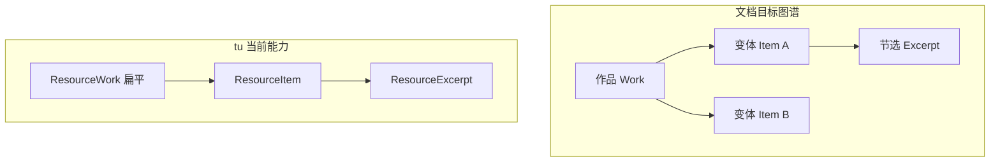
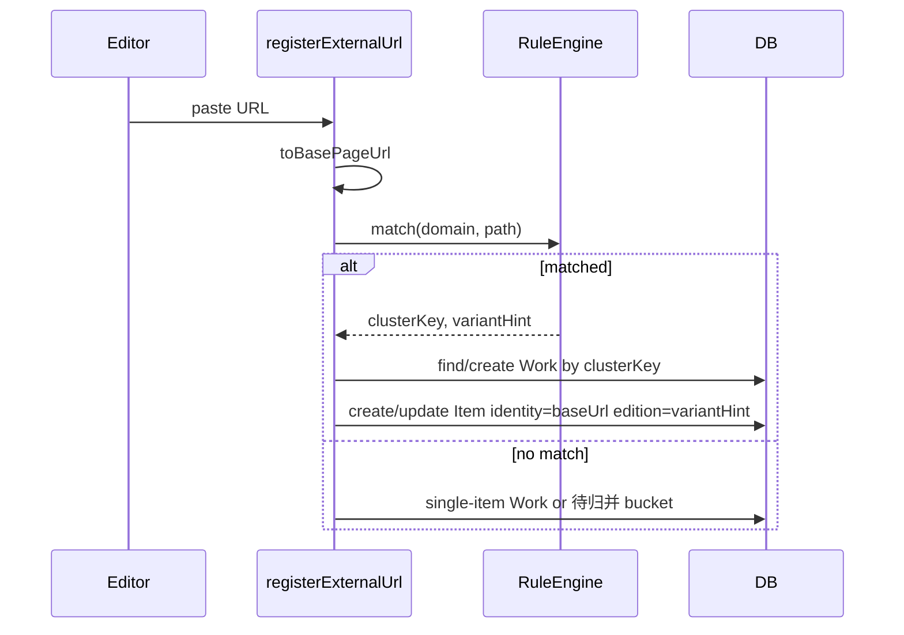

# URL 识别功能改造 — 评估与实现路线

## 1. 文档在说什么（修正后的产品目标）

文档经历两轮澄清，核心已从「领域分类（前端/后端）」转为 **资源实体识别（Entity Resolution）**：

| 概念 | 含义 | 在 tu 中的近似模型 |
|------|------|-------------------|
| 作品 / 同一性 | 多 URL 是否指向同一本书/同一作品 | [`ResourceWork`](tu-backend/src/main/java/com/tu/backend/externalresource/entity/ResourceWorkEntity.java)（UI：资源归类） |
| 变体实例 | 翻译版、PDF/EPUB、不同站点镜像 | [`ResourceItem`](tu-backend/src/main/java/com/tu/backend/externalresource/entity/ResourceItemEntity.java) + `edition` 字段 |
| 同页子资源 | 同一 URL 下锚点、文本片段 | [`ResourceExcerpt`](tu-backend/src/main/java/com/tu/backend/externalresource/entity/ResourceExcerptEntity.java) |
| 层级关系 | 原版 ↔ 翻译、完整版 ↔ 节选 | **尚无** 关系表或 Work 树结构 |



---

## 2. 功能点拆解与评估

### 2.1 URL 前缀 / 模板自动归并（规则引擎）

**文档方案**：按域名维护 URL 模板（如 `/books/{id}/{variant}`），用 Trie/Radix 匹配；提取 `id` 作为聚类键，避免 O(N²) 全量相似度比对；无模板时再走模糊管线（**含 AI，本期不做**）。

**现状**：
- 前端 [`parseExternalUrl`](tu-web-ts/src/utils/externalUrlResource.ts) 仅做 **hash 分流**：无 hash → 整页 `web-link`；有 hash → 同页 `ResourceExcerpt`。
- 粘贴登记 [`registerExternalUrlFromPaste`](tu-web-ts/src/api/externalResource.ts) 用 **`baseUrl` 作 identity**，与节选模型一致。
- **问题 A**：自动登记时 **每个链接新建一个 Work**（`createWebLinkItem` 内 `createResourceWork`），与文档「同 ID 变体归入同一作品」相反。
- **问题 B**：后端引用扫描 [`resolveResourceItemIdByUrl`](tu-backend/src/main/java/com/tu/backend/reference/service/ReferenceService.java) 用 **完整 URL 精确匹配** `identityValue`，未统一 strip hash / normalize path，可能与前端 `baseUrl` 策略不一致，导致重复 Item。
- **无** URL 模板表、Trie、聚类键字段。

**评估**：方向正确，且与现有 `typeId + identityValue` 唯一约束兼容；应把「模板提取的 `clusterKey`」映射到 **复用已有 Work**，而不是新建 Work-per-URL。Trie 可在规则量 &gt; 数百条时再引入；首期用「按 domain 索引的规则列表 + 最长匹配」即可。

**建议首期规则来源**（无 AI）：
1. 内置少量高价值域名模板（GitHub repo、常见电子书站 path 含数字 ID 等）。
2. 用户可在资源管理中维护「域名 + 路径正则 + capture 组」规则（冷启动）。
3. 兜底：仅 `hostname + 规范化 path 前缀` 弱聚类（仍不合并跨站，避免误并）。

---

### 2.2 作品命名：Title 自动 vs 手动锁定

**文档方案**：名称来自标题抽取 / 多标题投票 / **AI**（本期不做）；字段带 `source: auto | manual | ai-suggested`；`manual` 后不被自动覆盖，可「重置为自动」。

**现状**：
- 自动命名：粘贴/引用侧用 **链接文本或 hostname**（[`getLinkTitle`](tu-web-ts/src/api/externalResource.ts)、[`deriveLinkTitle`](tu-backend/src/main/java/com/tu/backend/reference/service/ReferenceService.java)），**未抓取页面 `<title>`**。
- Work / Item **无 `source` 字段**；用户可在 [ResourceManagerView](tu-web-ts/src/views/ResourceManagerView.vue) 手工改 title / workId / edition，但下次自动登记仍可能新建实体，不会「锁定」。
- 引用层已有 [`bindingMode`](tu-web-ts/src/api/reference.ts)（`auto | manual_bound | manual_unbound`），这是 **页面引用 ↔ 资源实体** 的绑定语义，**不等于** 作品字段的来源标记。

**评估**：`source` 标记值得做，且应挂在 **Work.title、Item.title、Item.workId**（归并目标）上；与引用 `bindingMode` 分层，避免混用。Title 抓取可作为独立小特性（服务端 HEAD/GET 或前端粘贴时已有 label 优先），不依赖 AI。

---

### 2.3 变体类型与层级（翻译 / 格式 / 版本）

**文档方案**：作品下多级：原版、翻译分支、格式变体；边带关系类型。

**现状**：
- `edition` 为 **128 字符自由文本**（表单「版本/版次」），无枚举、无 Item↔Item 关系。
- Work **无 parentId**，无法表达「翻译分组」树。

**评估**：短期用 **`edition` + 约定标签**（如 `zh-TW`、`pdf`、`译:范晔`）可支撑列表筛选；中期若要做图谱视图，需新增 `resource_relation`（`fromItemId`, `toItemId`, `relationType`）或 Work 嵌套。不必一期上全量图谱 UI。

---

### 2.4 多用户共识（个人 / 公共）

**文档方案**：个人映射表 + 公共聚合视图、投票、AI 仲裁、采纳公共分类。

**你的选择**：**暂缓**。

**现状**：`external_resource_*` 表 **无 userId/tenant**；全库单一视图。

**评估**：与 tu 当前单租户知识库一致；共识层应作为 **独立里程碑**，且依赖账号体系。近期只需保证：**从资源库移除 Item 不阻断页面引用**（已实现 `removeItem` 不校验 in-use）。

---

### 2.5 自动识别 — AI（明确排除）

文档中的 **AI 语义归类、AI 消歧、AI 公共仲裁、LSH 模糊聚类** 均标为 **Out of Scope**。

首期无模板命中时的策略建议：
- 保持 **单 URL → 单 Item**，归入默认 Work 或「待归并」Work；
- UI 提示「可手动合并到同一资源归类」；
- **不** 调用 LLM、不建 embedding 索引。

---

## 3. 与已实现「粘贴 URL」能力的关系

近期已落地的粘贴链路（对话摘要）与文档 **部分重合**：

| 能力 | 状态 | 说明 |
|------|------|------|
| 同页 hash → 节选 | 已实现 | `parseExternalUrl` + `registerExternalUrlFromPaste` |
| 整页 URL → web-link Item | 已实现 | `identityValue = baseUrl` |
| 同书多 URL / 多语言 path | 未实现 | 缺模板与 Work 复用 |
| 后端引用扫描对齐 baseUrl | 待统一 | ReferenceService 应复用同一 normalize 工具 |
| 自动创建 Work 策略 | 需改 | 应从「每链一新 Work」改为「按 clusterKey 复用 Work」 |

---

## 4. 推荐实现路线（无 AI、无多用户）

### Phase 0 — URL 规范化单一事实来源（小、应先做）

- 抽取共享模块（前后端各一份或后端 API 规范化）：`stripHash`、`normalizePathname`、`toBasePageUrl`（与 [externalUrlResource.ts](tu-web-ts/src/utils/externalUrlResource.ts) 一致）。
- 改造 [`resolveResourceItemIdByUrl`](tu-backend/src/main/java/com/tu/backend/reference/service/ReferenceService.java) / `resolveOrCreateResourceItemIdByUrl`：先查 `baseUrl`，再查带 hash 的 legacy identity；创建时 **identity 一律写 baseUrl**。
- 数据迁移脚本（可选）：合并重复 web-link Item（同 baseUrl 多条）。

### Phase 1 — URL 模板归并（文档核心，规则版）

**数据模型（建议）**：

```text
url_cluster_rule: id, domain, path_pattern, id_capture_group, variant_capture_group?, priority, enabled
resource_work.cluster_key (nullable): 如 "example.com|books|12345"
```

**流程**：



**实现要点**：
- 规则引擎：按 `domain` 过滤后 **最长 pattern  wins**；捕获组生成 `clusterKey`。
- 修改 [`createWebLinkItem`](tu-web-ts/src/api/externalResource.ts) 与后端对称逻辑：**先 `findWorkByClusterKey`，无则创建**。
- 资源管理 UI：规则 CRUD Tab（可先只读内置 + 少量自定义）。

### Phase 2 — 手动锁定与合并工具（文档「manual 不再覆盖」）

- 为 `ResourceWork` / `ResourceItem` 增加 `titleSource`、`workIdSource`（enum: `auto` | `manual`）。
- 自动流程写字段前检查：若 `manual` 则跳过覆盖。
- UI：[ResourceManagerView](tu-web-ts/src/views/ResourceManagerView.vue) 增加 **「合并到归类」「拆分为新归类」「重置为自动」**；列表展示 `edition` / 规则推断的 variant。
- 可选：粘贴时用用户提供的 label 写 title，并标 `manual`（若用户改过标题）。

### Phase 3 — 关系与命名增强（仍无 AI）

- 结构化 `edition` 或新增 `variantKind` 枚举：`translation | format | edition | mirror | other`。
- 新增 `resource_item_relation` 表（可选，用于「B 是 A 的翻译」）；资源管理只读列表即可。
- 页面 title 抓取（HTTP 或浏览器侧）：仅当 `titleSource=auto` 且 title 为空/为 hostname 时更新。

### 暂缓（按你的选择）

- 多用户个人/公共层、投票、争议状态 UI。
- AI 聚类、AI 命名、AI 共识。

---

## 5. 风险与产品决策

| 风险 | 缓解 |
|------|------|
| 弱规则误把不同书并到同一 Work | 规则需 **显式 ID 段**（数字/UUID）；无 capture 则不并；UI 可拆分 |
| 跨域同一 ISBN 书 | 首期不做；图书类型继续用 `identityValue=ISBN` 精确去重，与 URL 模板并行 |
| 移除 Item 后引用变 broken | 已通过「移除不校验 in-use」接受；引用列表需继续显示 broken + 重绑 |
| 规则库冷启动 | 内置 5–10 条 + 用户自定义；无匹配进「待归并」 |

---

## 6. 结论

- **文档与 tu 方向一致**：`ResourceWork` = 作品、`ResourceItem` = 变体、`ResourceExcerpt` = 同页子资源；粘贴 hash 逻辑已是文档中「同一 URL 下不同资源」的子集。
- **最大缺口**：URL 模板聚类 + Work 复用策略，以及前后端 URL 规范化不一致；自动流程「每链一新 Work」与文档相反。
- **近期可交付价值**（无 AI、无多用户）：Phase 0 + Phase 1 + Phase 2 即可覆盖文档 80% 的单用户场景；Phase 3 提升可维护性。
- **明确不做**：AI 自动识别/消歧/共识；多用户层待账号与需求成熟再做。
