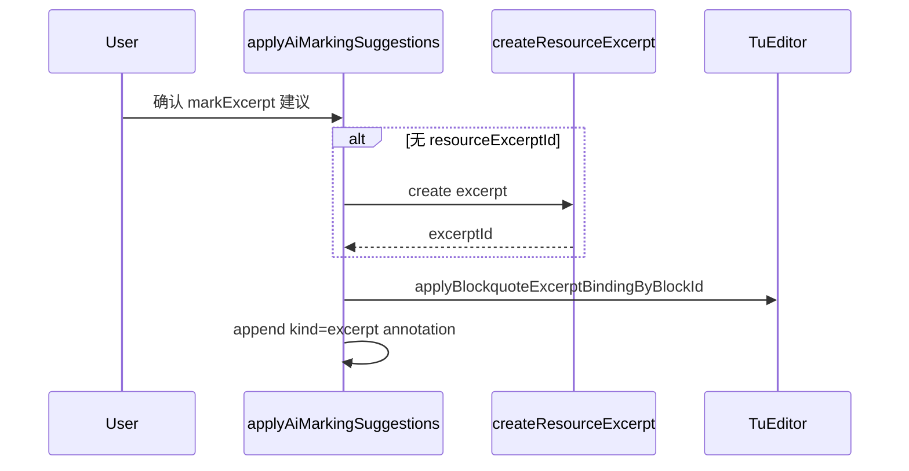

# AI 文档标记 Phase 2 — 设计草案

> **状态**：`draft`（仅设计，未实施代码）
> **关联 MVP**：[knowledge-relations.md §6](./knowledge-relations.md)（AI 文档标记 MVP）
> **计划索引**：[`.cursor/plans/ai-document-marking-phase2.plan.md`](../../.cursor/plans/ai-document-marking-phase2.plan.md)

## 元信息

| 项 | 说明 |
|----|------|
| 目标 | 让 AI 能**通读文档**、按合适粒度推断内容与**外部资源节选**的对应关系，对**未标记**片段提出建议 |
| 非目标 | 本期文档**不写实现代码**；不改造 LLM thinking 流式展示；不替代用户确认环节 |
| 与 MVP 边界 | MVP 保留：SSE 阶段进度、预览确认、`markerSource=ai`、Protected 手动标记不可覆盖。Phase 2 扩展上下文、推断策略与应用路径 |

---

## 跨 Agent 使用说明

每次新开 Agent 会话，复制：

```text
继续 AI 文档标记 Phase 2 设计，只写设计稿不实现代码。
主文档：tu-web-ts/docs/ai-document-marking-phase2-design.md
计划索引：.cursor/plans/ai-document-marking-phase2.plan.md
本次设计条目：{slice | resource-ctx | prompt-strategy | agent-tools | apply-mark-excerpt | protected-blockquote}
请先读该条 §N 现状，帮我补全或修订「设计思路」和「开放问题」，更新文档与 plan todo 状态。
```

设计条目建议顺序：`slice` → `protected-blockquote` → `resource-ctx` + `agent-tools` → `prompt-strategy` → `apply-mark-excerpt`。

---

## 总览

| ID | § | 标题 | 状态 |
|----|---|------|------|
| `slice` | §1 | 文档结构化切片 | designed |
| `resource-ctx` | §2 | 资源上下文加厚 | designed |
| `prompt-strategy` | §3 | Prompt 与推断策略 | designed |
| `agent-tools` | §4 | Agent 专用工具 | designed |
| `apply-mark-excerpt` | §5 | markExcerpt 写回文档 | designed |
| `protected-blockquote` | §6 | blockquote 节选 Protected + 种子上下文 | designed |

---

## §1. 文档结构化切片（`slice`）

### 状态

designed

### 用户故事

作为作者，我希望 AI 分析时能区分文档中的**标题节、普通段落、引用块（blockquote）**等单元，并对**每个未标记单元**单独给出资源对应建议，而不是只对整页或某一标题节笼统建议。

### 现状与缺口

- **相关文件**
  - 后端：[`DocumentMarkingContextCollector.java`](../../tu-backend/tu-backend-app/src/main/java/com/tu/backend/ai/documentmarking/DocumentMarkingContextCollector.java)
  - 前端 blockquote：[`blockquoteExcerpt.ts`](../src/utils/blockquoteExcerpt.ts)、[`BlockquoteNode.ts`](../src/editor/extensions/BlockquoteNode.ts)
  - 证据 locator 约定：[knowledge-relations.md §3](./knowledge-relations.md)
- **MVP 行为**
  - `collectSectionTexts` 产出两类：`page:{pageId}:heading:{blockId}`（标题 + 下属正文，截断 1200 字）与 `page:{pageId}:block:{richtextBlockId}`（整文档块）
  - blockquote 文本合并进 heading 节或整页 block，**无独立 locator**
  - 建议 JSON 的 `locator` 仅文档化为 `heading` / `annotation` / `block`
- **已知限制**
  - 模型无法指向「第 2 个 blockquote」
  - `applyAiMarkingSuggestions` 的 `markExcerpt` 无法绑定到 blockquote（见 §5）
  - 段落级 `paragraph:{n}` 在资源库已有（节选 `locator` 字段），但文档证据层尚无对应格式

### 设计目标（可验收）

- [ ] Prompt 中 `Section texts` 包含 **blockquote 级**切片，每条有稳定 locator
- [ ] 可选包含 **段落级**切片（同 richtext 块内按 `paragraph` 节点）
- [ ] 建议校验层接受新 locator 前缀；MVP 的 heading/block locator **仍合法**
- [ ] 前端 `DocumentMarkingReviewPanel` 能展示 locator 类型（blockquote / paragraph）

### 设计思路

#### 方案 A：新增 `blockquote` 证据 locator

格式：`page:{pageId}:blockquote:{blockId}`

- `blockId` 复用 Tiptap `blockquote` 节点 `attrs.blockId`（已有 `createBlockquoteBlockId()`）
- 收集器遍历 Tiptap document，对每个 blockquote 输出 `{ locator, title: "引用", text }`
- **优点**：与手动标记节选（blockquote + `excerptBinding`）一一对应；应用层可直接写 binding
- **缺点**：需扩展 `knowledge-relations.md` 证据层表格与 `validateSuggestions` 白名单

#### 方案 B：扩展现有 `block` locator 加子类型

格式：`page:{pageId}:block:{parentBlockId}:span:{spanId}`，JSON 建议增加 `spanKind: blockquote | paragraph`

- **优点**：不新增顶层 anchorKind
- **缺点**：locator 解析分散；与现有 `KnowledgeAnchor` 类型不一致；应用层更复杂

#### 倾向决策

**采用方案 A（`blockquote` locator）**；段落级作为 Phase 2.1 可选扩展：

- 段落 locator：`page:{pageId}:paragraph:{blockId}:{index}`（`blockId` 为所属 richtext 块，`index` 为 doc 内 paragraph 序号）
- 首期 **优先 blockquote**（用户主场景：引用区标记节选）；段落级用于非 blockquote 的正文溯源

#### 开放问题

- 嵌套 blockquote / 列表内 blockquote 是否单独切片？→ **首期：每个 blockquote 节点一律切片，不合并**
- ref 嵌入块内 blockquote 是否纳入？→ **首期：仅主文档 richtext；embed 内走现有 `sectionEmbedBlockId` 范围**
- `SECTION_TEXT_MAX` 对 blockquote 是否单独设更小上限？→ **建议 800 字/blockquote，整节仍 1200**

### 依赖与接口影响

- 后端：`DocumentMarkingContextCollector.collectBlockquoteTexts()`（新）；`userPrompt` 增加 `Blockquote texts:` 段
- 前端：`knowledge-relations.md` §3 增 `blockquote` 行；`buildAnchorFromLocator` 扩展
- Prompt：`systemPrompt` locator 说明补充 `page:{pageId}:blockquote:{blockId}`

### 验收场景

- **Given** 页内有 2 个 blockquote，仅第 1 个已手动标记节选
- **When** 整页 AI 分析
- **Then** 建议列表中出现针对第 2 个 blockquote 的 locator（非整页 block），且不含已保护 locator

---

## §2. 资源上下文加厚（`resource-ctx`）

### 状态

designed

### 用户故事

作为作者，我希望 AI 比对文档片段时能看到**资源节选的正文与定位**，而不仅是资源/节选标题，从而发现「同书其他章节」或「未标记的引用段落」。

### 现状与缺口

- **相关文件**：[`DocumentMarkingAgentService.appendResourceCatalog`](../../tu-backend/tu-backend-app/src/main/java/com/tu/backend/ai/DocumentMarkingAgentService.java)（每资源最多 5 条节选，**仅 title**）
- **MVP 行为**：`Resource catalog` 最多 30 个 item；无 `excerptText`、无 `locator`（page/paragraph）
- **已知限制**：模型无法做文本相似度对齐；已有用户节选仅通过 Protected 列表出现 `resource:{itemId}:excerpt:{id}`，无正文

### 设计目标（可验收）

- [ ] 对用户已标记资源（Protected / 种子，见 §6）相关的 **resourceItem**，prompt 附带节选正文摘要
- [ ] 节选正文截断策略明确（字符上限 + 优先用户标记节选全文）
- [ ] 不一次性灌入全库所有节选（控制 token）

### 设计思路

#### 方案 A：Prompt 静态加厚（仅种子相关资源）

1. 从 Protected + Seed 条目收集 `resourceItemId` 集合
2. 对每个 item 拉取节选（上限 N 条，优先：已 Protected 的 excerptId 排前）
3. 每条输出：`excerptId | title | locator | text(截断 600)`

#### 方案 B：全库 catalog 加厚

- 对所有 item 附带 excerpt 正文 → **token 爆炸，否决**

#### 方案 C：仅 Agent 工具按需拉取（见 §4）

- Prompt 只给 itemId 列表；模型 tool call 拉正文 → 与方案 A **组合**

#### 倾向决策

**A + C 组合**：

- 默认 prompt 嵌入「种子资源」的节选摘要（方案 A，`SEED_EXCERPT_TEXT_MAX = 600`）
- 模型可通过 `listResourceExcerpts(itemId)` 按需拉更多（§4）
- `appendResourceCatalog` 保留标题索引作全局目录，正文仅种子相关

#### 开放问题

- 无种子标记时是否分析全库？→ **首期：仅 catalog 标题 + 工具按需查询；不做全库正文灌入**
- 节选 `excerptText` 为空（仅 URL 定位）时用什么？→ **用 title + locator + resourceItem 摘要字段**

### 依赖与接口影响

- 后端：`userPrompt` 新增 `Seed resource excerpts:`；常量 `SEED_EXCERPT_TEXT_MAX`
- 依赖 §6 的种子收集 API
- 无新 REST（MVP 阶段）；工具见 §4

### 验收场景

- **Given** 页内一处 blockquote 已绑定资源 A 的节选 X
- **When** AI 分析
- **Then** prompt 中包含节选 X 的正文摘要，以及资源 A 下其它节选标题列表

---

## §3. Prompt 与推断策略（`prompt-strategy`）

### 状态

designed

### 用户故事

作为作者，我希望 AI **以已有标记为线索**，在全文查找**同一资源**的其它片段并建议标记，而不是重复建议已标记区域或只输出一条 obvious 建议。

### 现状与缺口

- **相关文件**：[`DocumentMarkingAgentService.systemPrompt/userPrompt`](../../tu-backend/tu-backend-app/src/main/java/com/tu/backend/ai/DocumentMarkingAgentService.java)
- **MVP 行为**：结尾仅 `Analyze the document and suggest knowledge markers`；Protected 列表标注 `DO NOT suggest changes`
- **已知限制**：未区分 Protected（禁止覆盖）与 Seed（推断线索）；无「同资源扩展」指令

### 设计目标（可验收）

- [ ] System prompt 明确四种 action 的使用场景与粒度选择规则
- [ ] User prompt 分 `Protected locators` 与 `Seed markers (expand from these)` 两节
- [ ] 明确：对 blockquote 未标记片段优先 `markExcerpt`；对标题优先 `bindSource`；对正文论据优先 `setBasis` 或 `createRelation`

### 设计思路

#### 推断策略（写入 systemPrompt 规则摘要）

1. **先读 Seed markers**：记录 `resourceItemId`、节选定位、文档 locator
2. **扫描 Section / Blockquote texts**：找与种子**同资源**且**文本相似或主题连续**的未标记单元
3. **不为 Protected locator 生成建议**；不为已有 excerptBinding 的 blockquote 重复 `markExcerpt`
4. **粒度选择**
   - 整段引用文字 → `markExcerpt` + `locator=blockquote:…`
   - 章节标题对应资源章节 → `bindSource`
   - 正文句子级依据 → `setBasis`（需 annotation locator；若无可先建议 blockquote/paragraph 级 markExcerpt）
   - 与知识点语义相关 → `createRelation`
5. **每条建议必须填** `reason`（简体中文）说明：与哪个种子、哪段资源节选对应
6. **confidence**：文本高度重合 ≥0.85；主题推断 0.6–0.8；弱相关 <0.6 可不输出

#### User prompt 结构修订

```
Seed markers (use as inference anchors; do NOT re-suggest these locators):
- page:…:blockquote:bq1 [excerpt] … — resourceItem=… excerpt=… summary=…

Protected locators (DO NOT suggest changes):
- …

Blockquote texts:
- page:…:blockquote:bq2: …

Section texts:
- …
```

#### 倾向决策

采用上述分节 + 规则；MVP 的 `Protected locators` 保留，**新增** `Seed markers`（来自 §6，含 blockquote binding 与用户节选）

#### 开放问题

- 是否允许 AI 建议「合并两个相邻 blockquote 为一个节选」？→ **首期：否，一条建议对应一个 locator**
- 跨页同资源是否在 Phase 2 支持？→ **首期：仅当前页 + 工具可搜 KB 作参考，建议 locator 限定当前 pageId**

### 依赖与接口影响

- 依赖 §1 locator、§2 种子节选正文、§6 Seed 列表
- 无 API 变更

### 验收场景

- **Given** 同页 2 个 blockquote 内容均来自资源 A 的不同节选，仅 BQ1 已标记
- **When** AI 分析
- **Then** 至少 1 条针对 BQ2 的 `markExcerpt` 建议，reason 提及资源 A 与对应节选

---

## §4. Agent 专用工具（`agent-tools`）

### 状态

designed

### 用户故事

作为作者，当文档引用的资源不在 prompt 种子里时，AI 仍能通过工具**查询资源库节选**并比对文本，而不是只能猜标题。

### 现状与缺口

- **相关文件**：[`AiAgentTools.java`](../../tu-backend/tu-backend-app/src/main/java/com/tu/backend/ai/AiAgentTools.java)（仅 `searchKnowledgeBasePages`、`queryKnowledgeBaseRag`）
- **MVP 行为**：document marking 与 learning plan 共用工具集；无资源库只读工具

### 设计目标（可验收）

- [ ] 新增只读工具：`listResourceItems`（分页/关键词）、`listResourceExcerpts(itemId)`、`getResourceExcerpt(excerptId)`
- [ ] 可选：`searchResourceExcerptText(query, itemId?)` — 在节选正文中关键词搜索
- [ ] 工具仅在 document marking 场景注册（或通用注册但 description 标明用途）

### 设计思路

#### 工具清单

| 工具 | 入参 | 返回 |
|------|------|------|
| `listResourceItems` | `query?`, `limit?` | `[{ id, title, typeName, workTitle }]` |
| `listResourceExcerpts` | `resourceItemId`, `limit?` | `[{ id, title, locator, textPreview }]` |
| `getResourceExcerpt` | `excerptId` | `{ id, itemId, title, locator, excerptText(truncated) }` |
| `searchResourceExcerptText` | `query`, `resourceItemId?`, `limit?` | 命中节选片段 + 得分 |

实现复用 `ResourceItemRepository` / `ResourceExcerptRepository`；`textPreview` 截断 300 字。

#### 注册方式

- 新建 `DocumentMarkingAgentTools` bean，`DocumentMarkingAgentService` 在 tool loop 传入 `[aiAgentTools, documentMarkingAgentTools]`
- 或在 `AiAgentTools` 增加方法但在 tool loop 描述中写「document marking 时优先使用」

#### 倾向决策

**独立 `DocumentMarkingAgentTools`**，避免 learning plan prompt 误用资源工具。

#### 开放问题

- 是否需要 ES 索引资源节选全文？→ **首期：DB `LIKE`/内存 filter，节选量小可接受**
- `searchResourceExcerptText` 是否首期必做？→ **可选；有 `list`+`get` 可先上线**

### 依赖与接口影响

- 后端：新类 + `DocumentMarkingAgentService` 工具数组
- 前端：无
- Mock：mock 模式可返回固定节选列表

### 验收场景

- **When** 模型收到无种子的高相似 blockquote
- **Then** run log 中出现 `listResourceExcerpts` 或 `searchResourceExcerptText` 调用，且最终建议含正确 `resourceItemId`

---

## §5. markExcerpt 写回文档（`apply-mark-excerpt`）

### 状态

designed

### 用户故事

作为作者，我确认 AI 的「标记节选」建议后，文档对应位置应出现与**手动标记节选**一致的视觉效果（blockquote 元信息条 + 节选高亮），而不是仅在资源库 silent 创建一条 excerpt。

### 现状与缺口

- **相关文件**：[`aiDocumentMarking.ts`](../src/utils/aiDocumentMarking.ts)（`markExcerpt` 仅 `createResourceExcerpt`）
- **手动路径**：[`TuEditorPage.vue`](../src/components/TuEditorPage.vue) + [`blockquoteExcerpt.ts`](../src/utils/blockquoteExcerpt.ts)（写 `excerptBinding` + `kind=excerpt` annotation）
- **已知限制**：建议 JSON 无 `targetBlockquoteId`；locator 若为 block 级无法落地

### 设计目标（可验收）

- [ ] `markExcerpt` 建议必须带 `locator` 为 `page:…:blockquote:…`（§1）或兼容迁移
- [ ] 应用时：创建/复用 ResourceExcerpt → 写 blockquote `excerptBinding` → 写 `kind=excerpt` annotation → `markerSource=ai`
- [ ] 若 excerpt 已存在（`resourceExcerptId` 在建议中），跳过创建，仅写文档绑定
- [ ] Review 面板展示将影响的 blockquote 预览文案

### 设计思路

#### 应用流程



#### 建议 JSON 扩展（向后兼容）

| 字段 | 说明 |
|------|------|
| `locator` | 必填，`…:blockquote:{blockId}` |
| `resourceItemId` | 必填 |
| `resourceExcerptId` | 可选；有则绑定已有节选 |
| `excerptText` | 无 excerptId 时必填 |
| `excerptTitle` | 可选 |
| `excerptLocator` | 可选，资源内定位 `page:N` / `paragraph:N` |

#### 倾向决策

- 复用 `TuEditor.applyBlockquoteExcerptBindingByBlockId`（已存在）
- `ApplyAiMarkingContext` 增加 `applyBlockquoteExcerptBindingByBlockId` 回调（与 heading 对称）
- AI 创建节选写 `metadata.markerSource=ai`

#### 开放问题

- 目标不是 blockquote 而是普通段落时怎么办？→ **首期：仅 blockquote；段落级用 setBasis + 范围 annotation（Phase 2.1）**
- 建议的 blockquote 为空文本？→ **校验拒绝，errors 提示**

### 依赖与接口影响

- 前端：`aiDocumentMarking.ts`、`ApplyAiMarkingContext`、`TuEditorPage` 传入 blockquote 回调
- 后端：可选在 `DocumentMarkingSuggestionDto` 增加 `excerptLocator`；校验 blockquote locator 存在性（blockId 在 page document 内）
- E2E：mock 模式一条 markExcerpt 建议 + 确认后 DOM 出现 `.tu-blockquote-excerpt-meta`

### 验收场景

- **Given** AI 建议 `markExcerpt` locator=`page:P:blockquote:BQ2`
- **When** 用户确认应用
- **Then** BQ2 上方出现元信息条；资源库有新节选；annotation `kind=excerpt` 且 `markerSource=ai`

---

## §6. blockquote 节选 Protected + 种子上下文（`protected-blockquote`）

### 状态

designed

### 用户故事

作为作者，我已手动标记的 blockquote 节选不应被 AI 重复建议；同时 AI 应把这些标记当作**推断同资源其它片段的种子**，而不是仅「禁止触碰」。

### 现状与缺口

- **后端** [`DocumentMarkingContextCollector`](../../tu-backend/tu-backend-app/src/main/java/com/tu/backend/ai/documentmarking/DocumentMarkingContextCollector.java)：收集 heading `sourceBinding`、`basis` annotation、用户 relation、DB 用户节选（`resource:…:excerpt:…`）；**不收集** blockquote `excerptBinding`、`kind=excerpt` annotation
- **前端** [`documentMarkingContext.ts`](../src/utils/documentMarkingContext.ts)：同上
- **缺口**：DB 节选 locator（`resource:…`）与文档 locator（`page:…:blockquote:…`）**不一致**，Protected 过滤挡不住对同一 blockquote 的重复建议

### 设计目标（可验收）

- [ ] 后端/前端 Protected 集合包含所有用户 blockquote 节选（`markerSource` 缺省或 `user`）
- [ ] User prompt 新增 **Seed markers** 列表（含 `resourceItemId`、`resourceExcerptId`、文档 locator、摘要）
- [ ] `validateSuggestions` 拒绝 locator 命中 Protected blockquote
- [ ] AI 标记的 blockquote（`markerSource=ai`）不进入 Protected，但进入 Reference（MVP 已有 heading/basis 的 ai 参考逻辑，需扩展 blockquote）

### 设计思路

#### Protected 收集规则

遍历 Tiptap document blockquote 节点：

- 有 `excerptBinding` 且 `markerSource != ai` → Protected  
  - locator: `page:{pageId}:blockquote:{blockId}`  
  - 同时保留 `resource:{itemId}:excerpt:{excerptId}` 条目（兼容 createRelation 校验）
- `kind=excerpt` annotation 覆盖 blockquote 且无 AI marker → 同上

#### Seed markers 列表（推断线索）

包含：

1. 所有 Protected blockquote 节选（标注为 seed，**禁止重复建议**）
2. Protected heading source / basis（已有，改标签为 seed）
3. 可选：同页用户节选 DB 记录在 prompt 中关联到最近 blockquote（启发式）

User prompt 示例：

```
Seed markers (expand to find unmarked spans from the SAME resourceItemId):
- page:p1:blockquote:bq1 | resourceItem=ri1 excerpt=re1 | "…摘要…"
```

#### 与 Protected 关系

| 列表 | 用途 |
|------|------|
| Protected | 校验过滤 + 模型「不得修改」 |
| Seed | 模型「从此扩展」；是 Protected 的子集 + 结构化字段 |

#### 倾向决策

- 后端 `collectProtected` 增 `walkBlockquotes`
- 前端 `collectProtectedLocators` 同步（保持 mock/测试一致）
- `collectSeedMarkers()` 新方法，输出 enriched 条目供 prompt

#### 开放问题

- 仅 DB 有 excerpt、文档未绑定 blockquote 的边缘数据？→ **Protected 仍用 resource excerpt locator；不生成 blockquote seed**
- 用户「转为手动标记」后是否立即成为 Seed？→ **是，`markerSource=user`**

### 依赖与接口影响

- 后端：`DocumentMarkingContextCollector`、测试 [`DocumentMarkingContextCollectorTest`](../../tu-backend/tu-backend-app/src/test/java/com/tu/backend/ai/documentmarking/DocumentMarkingContextCollectorTest.java)
- 前端：`documentMarkingContext.ts`、`documentMarkingContext.test.ts`
- Prompt：§3 分节

### 验收场景

- **Given** blockquote BQ1 已手动 markExcerpt
- **When** AI 分析
- **Then** 建议中无 BQ1 locator；prompt Seed 含 BQ1；若有 BQ2 未标记且同资源，有 BQ2 建议

---

## 设计完成门槛（进入实现前）

- [x] §1–§6 均为 `designed`
- [ ] 实现计划单独开 PR/Agent，按依赖顺序：`§6+§1` → `§2+§4` → `§3` → `§5`
- [ ] 实施后回写 [knowledge-relations.md](./knowledge-relations.md) 与 [AGENTS.md](../../AGENTS.md)
