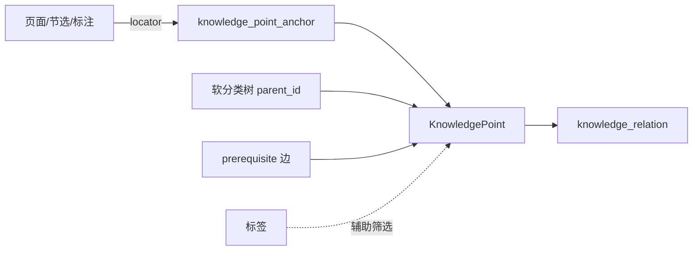

# 知识关联（Knowledge Relations）— Phase 1.5

> 状态：**已实施（Phase 1.5）**
> 关联：[tu-frontend-ui SKILL §6](../../.cursor/skills/tu-frontend-ui/SKILL.md)、[tree-structure-management.md](./tree-structure-management.md)

## 1. 目标

跨页面、节选、标注等位置建立**可扩展语义关系**（如「案例」「依据」「前置」），支持双向反查与跳转。关系端点为**知识点（KnowledgePoint）**；页面/节选/标注作为**证据（evidence）**绑定到知识点，可随编辑迁移。

Phase 1.5：**知识点中间层 + 建链 + 定位 + 分页列表**；图谱投影与学习路线见 Phase 2/3。

## 2. 三层架构

| 层 | 职责 | 是否进入 `knowledge_relation` |
|----|------|--------------------------------|
| **结构层** | 页面目录、资源章节、TOC 大纲 | 否 |
| **语义层** | 知识点身份、前置/案例/依据 | **是（端点为知识点 ID）** |
| **证据层** | 「这段话/这页在讲哪个点」 | 否（`knowledge_point_anchor`） |

- **软分类树**（`knowledge_point.parent_id`）仅分组浏览，**不**隐含前置关系
- **前置**只用 `prerequisite` 有向边；标签横切筛选，不驱动学习路线

## 3. 锚点 locator 约定（证据层）

| `anchorKind` | locator 格式 | 示例 |
|--------------|-------------|------|
| `page` | `page:{pageId}` | `page:abc` |
| `heading` | `page:{pageId}:heading:{blockId}` | `page:abc:heading:h1` |
| `section` | `page:{pageId}:section:{sectionKey}` | `page:abc:section:local:blk` |
| `annotation` | `page:{pageId}:annotation:{id}` | `page:abc:annotation:ann1` |
| `resourceItem` | `resource:{itemId}` | |
| `resourceExcerpt` | `resource:{itemId}:excerpt:{excerptId}` | |
| `block` | `page:{pageId}:block:{blockId}` | 文档内嵌入块（画板、表格、PDF 等） |
| `block`（PDF 页） | `page:{pageId}:block:{blockId}:pdfPage:{n}` | 跳转到 PDF 摘页块内第 n 页 |

`snapshot` JSON 存展示用标题等；跳转以 locator 为准。反查路径：`by-anchor` → 找到关联知识点 → `by-point` 展示点间关系。

**页面级反查**：`GET /api/kbs/{kbId}/pages/{pageId}/knowledge-context` 聚合 `locator = page:{pageId}` 与 `locator LIKE page:{pageId}:%` 的全部证据锚点，并汇总各绑定点的 `prerequisite` 前驱/后继（见 §8）。

### 3.1 资源内定位（节选 `locator` 字段）

存储于 `external_resource_excerpt.locator`，表示节选在**外部资源**内的位置（与证据层 `resource:{itemId}:excerpt:{excerptId}` 互补）：

| 类型 | 规范格式 | 示例 | 展示 |
|------|---------|------|------|
| 锚点 | `anchor:{fragment}` | `anchor:intro` | `#intro` |
| 页码 | `page:{n}` | `page:18` | 第 18 页 |
| 页码范围 | `page:{start}-{end}` | `page:1-20` | 第 1–20 页 |
| 段落 | `paragraph:{n}` | `paragraph:3` | 第 3 段 |

工具：`tu-web-ts/src/utils/resourcePositionLocator.ts`；UI：`ResourcePositionLocatorField.vue`（标记节选、资源管理节选表单）。粘贴带 `#` 的链接时自动写入 `anchor:…`；历史 `#…` / `p. 18` 等形式读入时自动规范化。

## 4. 关系类型注册表

- 系统预置（`kbId = null`）：`source`、`basis`、`case`、`cites`、`related`、`association`（联想）、`prerequisite`
- 知识库可 `POST /api/kbs/{kbId}/relation-types` 扩展自定义类型
- `related`、`association`（联想）为双向；其余默认有向（fromPoint → toPoint）

## 5. 与树 / 标注 / 标签 / 页面的边界

| 概念 | 用途 | 存储 |
|------|------|------|
| **标签** | 分类、筛选 | 页面/块/节 metadata；知识点 `metadata_json` 辅助 chips |
| **知识点软分类树** | 概念分组浏览 | `knowledge_point.parent_id`（与 `PageItem` 无 FK） |
| **关系** | 语义边（案例、依据、前置…） | `knowledge_relation.from_point_id` / `to_point_id` |
| **证据** | 位置绑定 | `knowledge_point_anchor` |
| **页面树** | 目录、导航 | `PageItem.parentId`；建链默认**不**以页面树为关系目标 |

知识关联边**不进入**页面父子树（同 `ResourceItemRelation`）；Phase 2 可投影到 X6 图谱。

## 6. 迁移与双写

| 现有能力 | 编辑真源 | 索引投影 |
|---------|---------|---------|
| `headingSource` | Tiptap heading attrs | 知识点 + `source` 边 + 证据 |
| `basis` 标注 | `TextAnnotation.basisBinding` | 知识点 + `basis` 边 + 证据 |
| Phase 1 anchor 关系 | — | 启动迁移：为 anchor 创建知识点并投影 point 边 |
| 用户建链 UI | — | `provenance=user` |
| AI 文档标记（用户确认后） | `markerSource=ai` / `source_provenance=ai` | 不自动覆盖手动标记；重跑可勾选「替换本页 AI 标记」 |

`saveContent` 后 rebuild 本页 migrated 关系；用户创建的关系与 AI 确认的关系不删除（AI 关系仅通过「替换本页 AI 标记」或 `DELETE /api/ai/document-marking/pages/{pageId}/ai-markers` 清理）。

### AI 文档标记（MVP）

- 编辑真源：`TextAnnotation.markerSource`、`HeadingSourceBinding.markerSource`（缺省 `user`）；节选 `external_resource_excerpt.metadata_json.markerSource`
- `source_provenance=ai`：用户确认后的 `createRelation` 建议；rebuild **不删**
- Protected：手动 headingSource / basis / 用户建链 / 用户节选 → AI 不得覆盖，作为 prompt 参考
- 触发：
  - **整页**：`TuEditorPage` 工具栏「AI 分析标记（整页）」
  - **本节**：节手柄「AI 分析标记（本节）」→ 请求体带 `sectionHeadingBlockId`（本地标题节）或 `sectionEmbedBlockId`（引用组/引用内节）+ `sectionTitle`
  - SSE `POST /api/ai/document-marking/analyze/stream` → `DocumentMarkingReviewPanel` 预览确认 → 前端 `applyAiMarkingSuggestions`
- Mock：`src/api/aiDocumentMarking.ts` + `src/mock/aiDocumentMarking.ts`
- Phase 2 设计草案（未实施）：[`ai-document-marking-phase2-design.md`](./ai-document-marking-phase2-design.md) — 文档切片、资源对齐、blockquote 节选写回等；索引 [`.cursor/plans/ai-document-marking-phase2.plan.md`](../../.cursor/plans/ai-document-marking-phase2.plan.md)

## 7. API

### 知识点

| 方法 | 路径 |
|------|------|
| GET | `/api/kbs/{kbId}/knowledge-points/tree` |
| GET | `/api/kbs/{kbId}/knowledge-points`（分页，`pageSize` 默认 10） |
| GET | `/api/kbs/{kbId}/knowledge-points/by-locator?locator=…` |
| GET | `/api/kbs/{kbId}/pages/{pageId}/knowledge-context`（本页绑定点 + `prerequisite` 前驱/后继） |
| POST | `/api/kbs/{kbId}/knowledge-points` |
| PATCH/DELETE | `/api/knowledge-points/{id}` |
| POST | `/api/knowledge-points/merge`（body: `sourcePointId`、`targetPointId`；源并入目标后删除源） |
| GET/POST/DELETE | `/api/knowledge-points/{id}/anchors` |
| GET/POST | `/api/knowledge-points/{id}/aliases` |
| DELETE | `/api/knowledge-point-aliases/{aliasId}` |
| POST | `/api/kbs/{kbId}/knowledge-points/generate/preview`（body: `sources`、`pageIds`；返回 `would_create` / `would_skip` 候选） |
| POST | `/api/kbs/{kbId}/knowledge-points/generate`（body: `sources` + `pageIds` 全量生成，或 `locators[]` 按预览勾选生成） |

`sources`：`page` / `heading` / `section` / `block`（兼容别名 `pageTree`、`documentHeadings`）。`generate` 仅创建知识点 + `primary` 证据锚点，不创建 `knowledge_relation`、不设置 `parent_id`（扁平生成）。同 locator 已绑定则跳过（幂等）。`block` 来源为顶层非 richtext 块；v2 单文档页若 embed 仅在 Tiptap 节点内，block 候选可能为空。

从正文/标题等内容推导知识点名称时，会先做**去除序号**预处理（如 `1.`、`一、`、`第1章`、`①`），语义顺序以知识点树的 `parent_id` / `sortOrder` 为准，不以标题里的编号为准（见 `KnowledgePointTitleNormalizer` / `knowledgePointTitle.ts`）。

### 关系

| 方法 | 路径 |
|------|------|
| GET | `/api/kbs/{kbId}/relation-types` |
| POST | `/api/kbs/{kbId}/relation-types` |
| GET | `/api/kbs/{kbId}/relations`（分页；支持 `pointId` 筛选） |
| POST | `/api/kbs/{kbId}/relations`（body: `fromPointId`, `toPointId`, `typeKey`） |
| GET | `/api/knowledge-points/{pointId}/relations?kbId=…` |
| GET | `/api/kbs/{kbId}/relations/by-anchor?locator=…`（桥接：证据 → 知识点 → 关系） |
| DELETE | `/api/relations/{id}` |

### AI 文档标记

| 方法 | 路径 |
|------|------|
| POST | `/api/ai/document-marking/analyze` |
| POST | `/api/ai/document-marking/analyze/stream`（SSE，`completed.result` 为 suggestions JSON） |
| DELETE | `/api/ai/document-marking/pages/{pageId}/ai-markers`（清理本页 `source_provenance=ai` 关系） |

### 知识图谱（Phase 2）

| 方法 | 路径 |
|------|------|
| GET | `/api/kbs/{kbId}/knowledge-graph`（query: `mode=full\|centered\|prerequisite`、`centerPointId`、`depth`、`direction=out\|in\|both`、`relationTypeKeys`、`maxNodes`） |

## 8. UI 约定

- 创建：`SelectionToolbar` →「建立关联」→ 弹窗「关联到知识点」：单选要挂靠的知识点；编辑器带入的可定位内容静默写入 `relation.from`，**不展示**证据栏、不做知识点↔知识点双选
- 知识点建立（含为内容绑定知识点）：资源管理「知识点」Tab、从定位系统生成、`createKnowledgePoint + sourceAnchor`；**不在**关联弹窗内提供
- 目标知识点可在 Picker 知识点树内直接新建：工具栏 `+` 创建顶层知识点，节点右键「添加子知识点」创建子级；新建知识点不自动绑定当前证据（独立于内容的标签式实体）
- 知识点树支持重命名：节点右键「重命名」，或选中节点后按 `F2`（管理面板与关联弹窗共用 `KnowledgePointTree`）
- 管理：资源管理「知识点」Tab（[`KnowledgePointTree.vue`](../src/components/knowledge/KnowledgePointTree.vue) 分类树为主：拖拽调层级、**Ctrl+点击多选**、右键新建/重命名/**合并到…**/删除；多选时右侧汇总已选列表，单选展示证据/别名/关联）
- **知识点合并**：树右键「合并到…」→ 选择保留的**目标**知识点（源及其子树不可选）→ 确认后删除源节点；源的直接子节点改挂到目标下，证据/别名/语义边迁移到目标（同 locator 或同类型边去重，源标题写入目标别名）
- **文档页知识点上下文**：[`PageKnowledgeContextBar.vue`](../src/components/PageKnowledgeContextBar.vue) 挂在 [`TuEditorPage.vue`](../src/components/TuEditorPage.vue) 标题行下方；**本页知识点**仅展示 `page:{pageId}` 页级锚点绑定的知识点（与知识点管理树中可管理的页级绑定一致，不含标题/节/块/标注等子 locator 自动生成的点）；**前驱** / **后继** 仍基于本页全部证据锚点关联的知识点聚合 `prerequisite` 出边 / 入边；点击芯片跳转到该点 primary 证据；关联创建后随 `knowledgeRelationRefreshKey` 刷新
- **知识图谱**：资源管理「知识图谱」Tab（[`KnowledgeGraphPanel.vue`](../src/components/knowledge/KnowledgeGraphPanel.vue)）：默认「知识点关联」（以中心点展开），需先选择中心知识点；支持「前置子图」；中心点用通用知识点选择器（见下）。子图选点沿语义关系 BFS 后，前端会用与 **KnowledgePointPicker 相同的分类树**（`GET .../knowledge-points/tree` / `parent_id`）并入 taxonomy 子孙并嵌套绘制；语义关系边仍连接具体知识点，不绘制 taxonomy 边。可对含分类子节点的容器**收起/展开内部子节点**（`Ctrl+点击` 多选后批量操作；收起后标题前显示 `▸`，语义边改挂到可见父节点）。中心点、模式、深度、方向、关系类型筛选与收起状态按**当前登录用户 + 知识库**写入 `localStorage` 并在下次打开时恢复（开发模式未登录时自动使用本地开发用户 `dev-local-user`）
- **知识点选择器（通用）**：[`KnowledgePointPickerPanel.vue`](../src/components/knowledge/KnowledgePointPickerPanel.vue)（树 + 搜索）；[`KnowledgePointPickerDialog.vue`](../src/components/knowledge/KnowledgePointPickerDialog.vue)（弹窗）；全局 `openKnowledgePointPicker()`（[`knowledgePointPicker.ts`](../src/utils/knowledgePointPicker.ts) + [`KnowledgePointPickerHost.vue`](../src/components/knowledge/KnowledgePointPickerHost.vue) 挂载于 `App.vue`）。任意页面可 `await openKnowledgePointPicker({ kbId, title, selectedId })` 或声明式 `<KnowledgePointPickerDialog v-model:visible @select />`
- **从定位系统生成**：知识点 Tab「从定位系统生成…」→ **Step 1** 选页面范围（整个知识库 / 当前工作区页面 / 自选页面树）→ **预览**（列出范围内全部 page/heading/section/block 候选）→ **Step 2** 表格勾选要生成的项（默认勾选「将新建」）→ **确认生成**。完成后刷新分类树
- **别名**：选中知识点后在详情区维护别名 chips；列表搜索与 Picker 搜索 Tab 可命中别名（副标题展示匹配别名）
- 查看：正文内点击标注/依据高亮或**标题节元数据条**（来源 chips + 节标签），均打开同一 `NotePopover`（来源、笔记/依据、关联知识点）；资源管理「知识关联」Tab 为全库视图
- **AI 标记**：文档页工具栏「AI 分析标记」；来源/依据徽章与关系列表显示 `AI` chip；可「转为手动标记」（`markerSource` → `user`）
- **标记来源（标题节）**：节手柄「标记来源」后，标题下方显示浅蓝元信息条（`来源` / 类型 / 归类 / 定位 / 节选名）；同条可并排显示节标签 chips；点击打开 `NotePopover`
- **标记节选**：创建资源库节选后，在文档对应位置写入 `kind=excerpt` 标注，并在 Markdown `>` 引用块（blockquote）上方显示浅蓝元信息条（资源节选 / 类型 / 归类 / 定位）；点击打开 `NotePopover`。绑定持久化为 `<!--tu:blockquote-excerpt ...-->` 注释 + 节点 `excerptBinding`。成功后写入用户「学习进行中」目标（`localStorage`，按用户分键；有 `resourceExcerptId` 优先节选，否则仅为 Item）。下次**粘贴正文**或**新建未绑定引用块并填入内容**时，若进行中目标含节选，划选工具栏上方出现倒计时确认条，确认后复用同一 `HeadingSourceBinding` 并刷新进行中时间戳；文档页顶栏展示「进行中」芯片可跳转资源页或清除
- 跳转：`navigateKnowledgePoint(pointId)` → 取 `is_primary` 证据 → `navigateKnowledgeAnchor(locator)`

## 9. Phase 2/3

- **Phase 2（已实施）**：知识点 + 关系 → X6 知识图谱（资源管理「知识图谱」Tab；API `GET /api/kbs/{kbId}/knowledge-graph`）
- **Phase 3（未实施）**：`prerequisite` 子图 + `estimated_hours` 学习路线与门禁
