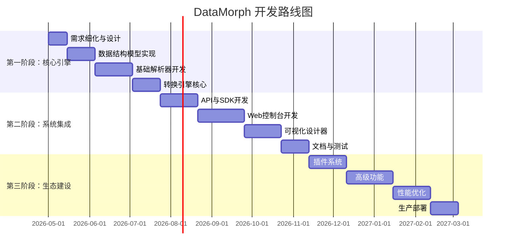

# 通用数据结构转换平台 - 软件开发准备工作文档

## 第一部分：项目愿景与范围文档

### 1.1 项目概览
**项目名称**：DataMorph (暂定) - 通用数据结构智能转换平台  
**项目代号**：Universal Structure Transformer (UST)  
**项目启动日期**：2026年4月29日  
**版本**：V1.0.0  

### 1.2 项目愿景
打造下一代数据互操作平台，让任意结构的数据能够"理解"彼此，打破数据孤岛，实现真正的数据自由流动。

### 1.3 问题陈述
**当前痛点**：
1. **结构多样性**：现代系统使用数十种数据格式（JSON/XML/YAML/Protobuf/Parquet等约定俗成的数据格式，或者不同网站、应用自己的数据格式等），手动转换成本高
2. **语义鸿沟**：相同数据在不同格式中结构差异大，难以自动化处理
3. **定制需求**：企业特有数据格式缺乏标准转换工具
4. **分析困难**：非结构化/半结构化数据难以提取关系信息
5. **维护成本**：N个数据格式需要O(N²)个转换器

**量化影响**：
- 暂无

### 1.4 解决方案亮点
1. **统一结构抽象**：建立通用的数据结构模型（UDM），统一表示所有数据格式
2. **智能结构识别**：基于机器学习的自动结构识别和关系提取
3. **声明式转换**：通过DSL描述转换规则，无需编写代码
4. **可视化编排**：图形化界面设计数据流和转换逻辑
5. **扩展生态**：插件化架构支持自定义解析器/转换器/分析器

### 1.5 核心价值主张
- **对开发者**：节省80%数据转换代码开发时间
- **对分析师**：一键从任意数据源提取结构化信息
- **对企业**：减少系统集成成本，加速数字化转型
- **对架构师**：统一数据治理，提升系统互操作性

### 1.6 项目范围边界

#### 包含范围（In-Scope）：
```
1. 核心转换引擎
   - 通用数据结构模型（UDM）
   - 结构识别算法框架
   - 转换规则执行引擎
   - 内置常见格式解析器（20+种）


```

#### 不包含范围（Out-of-Scope）：
- 不提供数据存储服务
- 不替代ETL/ELT工具的核心功能
- 不处理实时流数据（V1.0阶段）
- 不支持二进制协议的反向工程
- 不替代专业的数据建模工具

### 1.7 目标用户画像

| 用户类型 | 使用场景 | 关键需求 |
|---------|---------|---------|
| **后端开发者** | 微服务间数据格式转换 | API友好、高性能、易于集成 |
| **数据工程师** | 数据管道中的数据格式统一 | 批量处理、调度集成、错误处理 |
| **前端开发者** | API数据适配前端需求 | 轻量级、浏览器兼容、TypeScript支持 |
| **数据分析师** | 多源数据整合分析 | 可视化、零代码、模板化 |
| **系统架构师** | 系统间数据标准制定 | 标准化、可扩展、可维护 |

### 1.8 成功指标（KPI）

#### 第一阶段（MVP，3个月）：
- ✅ 支持x种核心格式互转（JSON↔↔Markdown）
- ✅ 实现3种结构识别（树形、组合、并列）
- ✅ 转换准确率 > 95%
- ✅ 平均转换延迟 < 100ms（1KB数据）
- ✅ 开发者友好API文档

#### 第二阶段（V1.0，6个月）：
- ✅ 支持15+种数据格式(XML↔YAML↔CSV)
- ✅ 实现完整结构识别（继承、引用、循环等）
- ✅ 转换准确率 > 99%
- ✅ 可视化转换设计器
- ✅ SDK支持3种语言
- ✅ 插件市场雏形

#### 第三阶段（V2.0，12个月）：
- ✅ 生态建设：50+社区贡献插件
- ✅ 企业客户：10+付费客户
- ✅ 性能：支持1GB+文件处理
- ✅ 云服务：SaaS平台上线
- ✅ 社区：1000+活跃开发者

### 1.9 技术约束与非功能需求


### 1.10 风险评估与缓解

| 风险      | 概率  | 影响  | 缓解措施                      |
| ------- | --- | --- | ------------------------- |
| 技术复杂度高  | 高   | 高   | 分阶段实现，MVP先行，核心算法外包        |
| 性能达不到预期 | 中   | 高   | 早期性能测试，关键路径优化，~~C++核心模块~~ |
| 竞争产品出现  | 中   | 中   | 差异化定位，强化社区生态，快速迭代         |
| 用户接受度低  | 低   | 高   | 用户共创，早期用户反馈，免费试用          |
| 安全漏洞    | 中   | 高   | 安全开发生命周期，第三方审计，漏洞赏金       |
|         |     |     |                           |

### 1.11 项目里程碑计划



### 1.12 预算与资源


### 1.13 相关文档链接
1. 详细需求规格说明书（见第二部分）
2. 技术架构设计文档
3. API接口文档
4. 用户手册
5. 部署运维指南
6. 安全合规白皮书

---

## 第二部分：详细需求规格说明书

### 2.1 功能需求

#### FR-001：通用数据结构模型（UDM）
**描述**：定义统一的数据结构表示模型

| ID | 功能点 | 优先级 | 验收标准 |
|----|--------|--------|----------|
| FR-001-01 | 基础类型系统 | 必须 | 支持20+基础数据类型 |
| FR-001-02 | 复合类型定义 | 必须 | 结构体、映射、数组、枚举 |
| FR-001-03 | 关系类型 | 必须 | 继承、组合、关联、引用 |
| FR-001-04 | 元数据支持 | 必须 | 类型注解、约束、文档 |
| FR-001-05 | 版本兼容性 | 应该 | 向前/向后兼容处理 |

**详细需求**：
- 支持类型推断和类型检查
- 提供类型转换规则库
- 支持自定义类型扩展
- 内置常用数据结构模式

#### FR-002：智能结构识别
**描述**：自动识别输入数据的结构和关系

| ID | 功能点 | 优先级 | 验收标准 |
|----|--------|--------|----------|
| FR-002-01 | 格式自动检测 | 必须 | 准确率 > 99% |
| FR-002-02 | 树形结构识别 | 必须 | 支持深度 > 20层 |
| FR-002-03 | 组合关系识别 | 必须 | 识别嵌套组合关系 |
| FR-002-04 | 继承关系识别 | 必须 | 自动识别父子类型 |
| FR-002-05 | 并列结构识别 | 必须 | 识别同级关联关系 |
| FR-002-06 | 循环引用检测 | 应该 | 自动识别并处理 |

**识别算法**：
1. **基于规则**：启发式规则识别常见模式
2. **基于统计**：机器学习模型识别复杂关系
3. **混合方法**：规则+统计结合提高准确率
4. **用户反馈**：人工标注改进识别模型

#### FR-003：数据转换引擎
**描述**：执行不同数据结构间的转换

| ID | 功能点 | 优先级 | 验收标准 |
|----|--------|--------|----------|
| FR-003-01 | 声明式转换规则 | 必须 | DSL语法简洁易用 |
| FR-003-02 | 内置转换模板 | 必须 | 100+常见转换场景 |
| FR-003-03 | 增量转换 | 应该 | 只转换变更部分 |
| FR-003-04 | 转换验证 | 必须 | 完整性、一致性检查 |
| FR-003-05 | 错误恢复 | 应该 | 优雅降级，部分转换 |

**转换DSL示例**：
```yaml
conversion:
  source: json
  target: xml
  
  rules:
    - map: $.user.name -> /user/name
    - transform: $.user.age
      using: age_to_category
      
  functions:
    age_to_category: |
      (age) => age < 18 ? "minor" : "adult"
```

#### FR-004：多格式支持
**描述**：支持多种数据格式的输入输出

**第一阶段（V1.0）支持**：
1. **标记语言**：JSON、XML、YAML、TOML、HTML
2. **文档格式**：Markdown、AsciiDoc
3. **结构化文本**：CSV、TSV、INI、Properties
4. **编程语言**：JavaScript/TypeScript对象、Python字典
5. **数据库**：SQL DDL、MongoDB查询
6. **其他**：目录树、URL查询字符串

**格式支持矩阵**：
```markdown
| 源格式 → 目标格式 | JSON | XML | YAML | CSV | MD | HTML |
|-------------------|------|-----|------|-----|----|------|
| JSON              | -    | ✓   | ✓    | ✓   | ✓  | ✓    |
| XML               | ✓    | -   | ✓    | ✓   | ✓  | ✓    |
| YAML              | ✓    | ✓   | -    | ✓   | ✓  | ✓    |
| CSV               | ✓    | ✓   | ✓    | -   | ✓  | ✓    |
| Markdown          | ✓    | ✓   | ✓    | ✓   | -  | ✓    |
| HTML              | ✓    | ✓   | ✓    | ✓   | ✓  | -    |
```

#### FR-005：可视化设计器
**描述**：图形化界面设计数据转换流程

**核心功能**：
1. **数据源连接**：连接各种数据源
2. **结构可视化**：图形化展示数据结构
3. **转换映射**：拖拽方式建立字段映射
4. **规则编辑器**：可视化编辑转换规则
5. **实时预览**：实时查看转换结果
6. **流程图**：设计复杂转换流程

**技术要求**：
- 基于Web的技术栈
- 支持Chrome/Firefox/Safari/Edge
- 响应式设计，支持桌面/平板
- 离线编辑能力
- 导入/导出转换配置

#### FR-006：扩展与集成
**描述**：支持插件扩展和系统集成

**插件系统架构**：
```
插件管理器
├── 解析器插件 (ParserPlugin)
├── 转换器插件 (TransformerPlugin)  
├── 输出器插件 (ExporterPlugin)
├── 分析器插件 (AnalyzerPlugin)
└── UI插件 (UIPlugin)
```

**集成方式**：
1. **API集成**：RESTful API + WebSocket
2. **CLI工具**：命令行界面
3. **SDK支持**：Java/Go/Python/JS SDK
4. **IDE插件**：VSCode/IntelliJ插件
5. **CI/CD集成**：GitHub Actions/GitLab CI模板

### 2.2 非功能性需求

#### NFR-001：性能需求
```yaml
响应时间:
  - 小数据(<1KB): < 50ms
  - 中数据(1KB-1MB): < 1秒
  - 大数据(1MB-100MB): < 30秒
  - 批量处理: 支持并行处理，线性扩展

吞吐量:
  - 单实例: > 1000转换/秒
  - 集群模式: 水平扩展，支持10k+转换/秒

资源使用:
  - 内存: < 512MB (基础运行)
  - 磁盘: < 1GB (含缓存)
  - CPU: 单核满足基准性能
```

#### NFR-002：可靠性需求
```yaml
可用性:
  - 目标: 99.9%
  - 维护窗口: 每月不超过4小时
  - 计划内维护: 提前72小时通知

容错性:
  - 单点故障: 无单点故障
  - 数据一致性: 最终一致性
  - 错误恢复: 自动重试，失败报警

备份恢复:
  - 配置备份: 每小时自动备份
  - 恢复时间目标(RTO): < 1小时
  - 恢复点目标(RPO): < 5分钟
```

#### NFR-003：安全性需求
```yaml
认证授权:
  - 认证方式: JWT/OAuth2.0/API Key
  - 权限控制: RBAC，细粒度权限
  - 会话管理: 安全会话，自动过期

数据安全:
  - 传输加密: TLS 1.3+
  - 存储加密: 敏感数据AES-256加密
  - 数据脱敏: 自动检测并脱敏敏感信息

安全合规:
  - 漏洞扫描: 每周自动扫描
  - 安全审计: 完整操作日志
  - 合规标准: GDPR/CCPA就绪
```

#### NFR-004：可维护性需求
```yaml
代码质量:
  - 测试覆盖率: > 80%
  - 代码规范: ESLint/SonarQube检查
  - 文档完整: API文档+用户手册

监控告警:
  - 监控指标: 200+监控指标
  - 告警规则: 分级告警(P1-P4)
  - 日志系统: 结构化日志，支持追踪

部署运维:
  - 容器化: Docker镜像
  - 编排: Kubernetes部署文件
  - 配置管理: 配置中心支持
```

#### NFR-005：兼容性需求
```yaml
平台兼容性:
  - Windows: 10/11, Server 2016+
  - macOS: 10.15+
  - Linux: Ubuntu 20.04+, CentOS 7+
  - 容器: Docker 20.10+, Podman 3.0+

浏览器兼容性:
  - Chrome: 90+
  - Firefox: 88+
  - Safari: 14+
  - Edge: 90+

运行时兼容性:
  - Java: 11/17/21
  - Node.js: 16/18/20
  - Python: 3.8/3.9/3.10/3.11
  - Go: 1.18/1.19/1.20
```

### 2.3 接口需求

#### API设计规范
```yaml
API风格: RESTful
数据格式: JSON
版本控制: URL路径版本(/v1/)
认证: Bearer Token
分页: limit/offset
排序: sort=field:asc|desc
过滤: filter[field]=value
字段选择: fields=id,name,email
错误响应:
  code: 错误码
  message: 错误信息
  details: 详细信息
```

#### 核心API端点
```yaml
# 转换相关
POST   /v1/convert           # 执行转换
GET    /v1/convert/{id}     # 获取转换结果
POST   /v1/batch-convert    # 批量转换
GET    /v1/formats          # 获取支持格式

# 结构识别
POST   /v1/analyze          # 分析数据结构
GET    /v1/analysis/{id}    # 获取分析结果
POST   /v1/detect           # 检测数据格式

# 模板管理
GET    /v1/templates        # 获取模板列表
POST   /v1/templates        # 创建模板
GET    /v1/templates/{id}   # 获取模板详情
PUT    /v1/templates/{id}   # 更新模板
DELETE /v1/templates/{id}   # 删除模板

# 插件管理
GET    /v1/plugins          # 插件列表
POST   /v1/plugins          # 安装插件
DELETE /v1/plugins/{id}     # 卸载插件
GET    /v1/plugins/{id}     # 插件详情

# 任务管理
GET    /v1/jobs             # 任务列表
GET    /v1/jobs/{id}        # 任务详情
POST   /v1/jobs/{id}/cancel # 取消任务
GET    /v1/jobs/{id}/logs   # 任务日志
```

#### WebSocket接口
```yaml
连接: ws://api.example.com/v1/ws
事件:
  - convert.progress: 转换进度
  - convert.complete: 转换完成
  - convert.error: 转换错误
  - system.alert: 系统告警
```

### 2.4 数据需求

#### 数据模型
```sql
-- 用户表
CREATE TABLE users (
  id UUID PRIMARY KEY,
  email VARCHAR(255) UNIQUE NOT NULL,
  username VARCHAR(100) UNIQUE NOT NULL,
  password_hash VARCHAR(255) NOT NULL,
  status VARCHAR(20) DEFAULT 'active',
  created_at TIMESTAMP DEFAULT CURRENT_TIMESTAMP,
  updated_at TIMESTAMP DEFAULT CURRENT_TIMESTAMP
);

-- 转换任务表
CREATE TABLE conversion_jobs (
  id UUID PRIMARY KEY,
  user_id UUID REFERENCES users(id),
  source_format VARCHAR(50) NOT NULL,
  target_format VARCHAR(50) NOT NULL,
  status VARCHAR(20) DEFAULT 'pending',
  input_size BIGINT,
  output_size BIGINT,
  duration_ms INTEGER,
  created_at TIMESTAMP DEFAULT CURRENT_TIMESTAMP,
  completed_at TIMESTAMP
);

-- 转换模板表
CREATE TABLE conversion_templates (
  id UUID PRIMARY KEY,
  name VARCHAR(200) NOT NULL,
  description TEXT,
  source_format VARCHAR(50) NOT NULL,
  target_format VARCHAR(50) NOT NULL,
  config JSONB NOT NULL,
  is_public BOOLEAN DEFAULT false,
  usage_count INTEGER DEFAULT 0,
  created_by UUID REFERENCES users(id),
  created_at TIMESTAMP DEFAULT CURRENT_TIMESTAMP
);

-- 插件表
CREATE TABLE plugins (
  id UUID PRIMARY KEY,
  name VARCHAR(200) NOT NULL,
  version VARCHAR(50) NOT NULL,
  plugin_type VARCHAR(50) NOT NULL,
  status VARCHAR(20) DEFAULT 'active',
  config_schema JSONB,
  created_at TIMESTAMP DEFAULT CURRENT_TIMESTAMP
);
```

#### 数据量预估
```yaml
初期(6个月):
  - 用户数: 1,000
  - 日转换任务: 10,000
  - 数据存储: 100GB
  - 峰值QPS: 50

中期(12个月):
  - 用户数: 10,000
  - 日转换任务: 100,000
  - 数据存储: 1TB
  - 峰值QPS: 200

长期(24个月):
  - 用户数: 100,000
  - 日转换任务: 1,000,000
  - 数据存储: 10TB
  - 峰值QPS: 1,000
```

### 2.5 用户界面需求

#### 界面布局
```
+-------------------------------------------------+
| 顶部导航栏                                    |
| Logo 搜索框 用户菜单 通知 帮助               |
+-------------------------------------------------+
| 左侧边栏        | 主工作区                     |
| • 转换器        |                             |
| • 模板库        |                             |
| • 历史记录      |                             |
| • 插件市场      |                             |
| • 设置         |                             |
+-------------------------------------------------+
| 状态栏                                          |
| CPU使用 内存 在线用户 系统状态                  |
+-------------------------------------------------+
```

#### 关键页面
1. **工作台**
   - 快速转换面板
   - 最近使用模板
   - 系统状态概览
   - 快速入门指南

2. **转换设计器**
   - 数据源选择区
   - 结构可视化区
   - 映射编辑区
   - 结果预览区
   - 转换配置区

3. **模板市场**
   - 模板分类浏览
   - 模板搜索过滤
   - 模板详情预览
   - 一键应用模板

4. **任务监控**
   - 任务列表表格
   - 实时进度展示
   - 错误日志查看
   - 批量操作功能

5. **系统管理**
   - 用户管理
   - 插件管理
   - 监控告警
   - 系统配置

### 2.6 约束条件

#### 技术约束
- 必须使用开源技术栈
- 核心引擎必须支持跨平台
- 必须提供Docker部署方式
- API必须支持版本控制
- 必须支持国际化（i18n）

#### 业务约束
- 免费版限制每日100次转换
- 企业版必须支持SAML/SSO
- 必须符合GDPR数据保护要求
- 必须提供数据导出功能
- 必须支持审计日志

#### 时间约束
- MVP版本3个月内发布
- 完整V1.0版本6个月内发布
- 每月一次功能迭代
- 每季度一次大版本更新

### 2.7 假设和依赖

#### 假设条件
1. 用户具备基本的技术理解能力
2. 输入数据大小通常在100MB以内
3. 网络环境稳定可靠
4. 用户接受云服务部署模式
5. 开源社区会贡献部分插件

#### 外部依赖
1. 云服务提供商（AWS/Azure/GCP）
2. 开源库和框架
3. 第三方认证服务
4. 代码托管平台（GitHub/GitLab）
5. CI/CD工具链

#### 风险依赖
1. 机器学习识别准确率
2. 复杂数据结构转换正确性
3. 性能优化效果
4. 用户接受度和采用率
5. 竞品发展速度

---

## 第三部分：技术架构设计文档

### 3.1 架构设计原则
1. **模块化**：高内聚低耦合，插件化架构
2. **可扩展**：水平扩展，无状态设计
3. **可靠性**：容错设计，自动恢复
4. **性能**：异步处理，缓存优化
5. **安全性**：最小权限，深度防御
6. **可观测性**：完整监控，追踪链路

### 3.2 系统架构图
```
┌─────────────────────────────────────────────────────┐
│                   客户端层                           │
│  ┌─────────┐  ┌─────────┐  ┌─────────┐  ┌─────────┐│
│  │ Web UI  │  │  CLI    │  │  SDK    │  │ IDE插件 ││
│  └─────────┘  └─────────┘  └─────────┘  └─────────┘│
└─────────────────────────────────────────────────────┘
                            │
┌─────────────────────────────────────────────────────┐
│                   API网关层                          │
│  ┌──────────────────────────────────────────────┐  │
│  │ 认证授权 │ 限流熔断 │ 日志追踪 │ 请求路由      │  │
│  └──────────────────────────────────────────────┘  │
└─────────────────────────────────────────────────────┘
                            │
┌─────────────────────────────────────────────────────┐
│                 业务服务层                           │
│  ┌─────────┐  ┌─────────┐  ┌─────────┐  ┌─────────┐│
│  │转换服务 │  │分析服务 │  │模板服务 │  │插件服务 ││
│  └─────────┘  └─────────┘  └─────────┘  └─────────┘│
└─────────────────────────────────────────────────────┘
                            │
┌─────────────────────────────────────────────────────┐
│                 核心引擎层                           │
│  ┌─────────┐  ┌─────────┐  ┌─────────┐  ┌─────────┐│
│  │结构识别 │  │转换引擎 │  │UDM模型  │  │规则引擎 ││
│  └─────────┘  └─────────┘  └─────────┘  └─────────┘│
└─────────────────────────────────────────────────────┘
                            │
┌─────────────────────────────────────────────────────┐
│                数据存储层                            │
│  ┌─────────┐  ┌─────────┐  ┌─────────┐  ┌─────────┐│
│  │ PostgreSQL │ Redis   │  │ MinIO   │  │  ES     ││
│  └─────────┘  └─────────┘  └─────────┘  └─────────┘│
└─────────────────────────────────────────────────────┘
```

### 3.3 技术栈选择

#### 后端技术栈
```yaml
主要语言:
  - Java 17 (Spring Boot 3): 业务服务，稳定成熟
  - Go 1.20 (Gin): 高性能服务，如转换引擎
  - Python 3.11 (FastAPI): 机器学习，数据分析

微服务框架:
  - Spring Cloud Alibaba: 微服务治理
  - gRPC: 服务间通信
  - Protocol Buffers: 接口定义

数据库:
  - PostgreSQL 15: 主数据库，ACID事务
  - Redis 7: 缓存，会话存储
  - Elasticsearch 8: 搜索，日志分析
  - MinIO: 对象存储

消息队列:
  - Apache Kafka: 异步处理，事件驱动
  - RabbitMQ: 任务队列

容器编排:
  - Docker 20.10+: 容器化
  - Kubernetes 1.26+: 容器编排
  - Helm: 应用部署
```

#### 前端技术栈
```yaml
框架:
  - React 18: UI框架
  - TypeScript 5: 类型安全
  - Vite: 构建工具
  - Zustand: 状态管理
  - React Query: 数据获取

UI组件:
  - Ant Design 5: 企业级组件
  - D3.js: 数据可视化
  - Monaco Editor: 代码编辑器
  - React Flow: 流程图

构建部署:
  - Webpack 5: 模块打包
  - ESLint + Prettier: 代码规范
  - Jest + React Testing Library: 测试
  - GitHub Actions: CI/CD
```

#### 运维监控
```yaml
监控:
  - Prometheus: 指标收集
  - Grafana: 监控面板
  - Loki: 日志聚合
  - Tempo: 分布式追踪
  - Alertmanager: 告警管理

部署:
  - Terraform: 基础设施即代码
  - Ansible: 配置管理
  - ArgoCD: GitOps部署
  - Harbor: 容器仓库

安全:
  - Vault: 密钥管理
  - Trivy: 安全扫描
  - Falco: 运行时安全
```

### 3.4 核心模块设计

#### 3.4.1 通用数据结构模型（UDM）
```java
// 核心接口定义
public interface DataType {
    String getName();
    DataTypeCategory getCategory();
    boolean isNullable();
    Set<Constraint> getConstraints();
}

public interface StructuredType extends DataType {
    Map<String, Field> getFields();
    Optional<StructuredType> getParentType();
    List<StructuredType> getChildTypes();
}

public enum DataTypeCategory {
    PRIMITIVE,   // 基本类型
    STRUCTURED,  // 结构类型
    COLLECTION,  // 集合类型
    REFERENCE,   // 引用类型
    CUSTOM       // 自定义类型
}

// 关系类型
public interface Relationship {
    RelationshipType getType();
    DataType getSource();
    DataType getTarget();
    Cardinality getCardinality();
}

public enum RelationshipType {
    INHERITANCE,   // 继承
    COMPOSITION,   // 组合
    AGGREGATION,   // 聚合
    ASSOCIATION,   // 关联
    DEPENDENCY     // 依赖
}
```

#### 3.4.2 结构识别引擎
```python
class StructureRecognizer:
    def __init__(self):
        self.recognizers = [
            TreeStructureRecognizer(),
            CompositeRecognizer(),
            InheritanceRecognizer(),
            AssociationRecognizer()
        ]
        self.ml_model = StructureRecognitionModel()
    
    def recognize(self, data: Any) -> RecognitionResult:
        # 基于规则的识别
        rule_results = []
        for recognizer in self.recognizers:
            result = recognizer.recognize(data)
            rule_results.append(result)
        
        # 基于ML的识别
        ml_result = self.ml_model.predict(data)
        
        # 结果融合
        return self.fuse_results(rule_results, ml_result)
    
    def fuse_results(self, rule_results, ml_result):
        # 加权融合算法
        pass
```

#### 3.4.3 转换引擎
```go
// 转换规则接口
type TransformationRule interface {
    Match(source interface{}) bool
    Transform(source interface{}, context TransformationContext) (interface{}, error)
    Validate() error
}

// 转换引擎
type TransformationEngine struct {
    rules        []TransformationRule
    ruleMatcher  RuleMatcher
    transformers map[string]Transformer
    cache        Cache
}

func (e *TransformationEngine) Transform(
    source interface{}, 
    sourceFormat string, 
    targetFormat string,
    options TransformOptions,
) (interface{}, error) {
    
    // 1. 解析源数据
    sourceData, err := e.parse(source, sourceFormat)
    if err != nil {
        return nil, err
    }
    
    // 2. 应用转换规则
    transformed, err := e.applyRules(sourceData, options.Rules)
    if err != nil {
        return nil, err
    }
    
    // 3. 序列化为目标格式
    result, err := e.serialize(transformed, targetFormat)
    if err != nil {
        return nil, err
    }
    
    return result, nil
}
```

### 3.5 数据流设计

#### 转换数据流
```
1. 输入阶段
   ┌────────────────┐
   │ 原始数据        │
   │ (JSON/XML/CSV) │
   └────────┬───────┘
            │
   ┌────────▼───────┐
   │ 格式检测器      │
   │ 自动检测格式    │
   └────────┬───────┘
            │
2. 解析阶段
   ┌────────▼───────┐
   │ 解析器         │
   │ 解析为中间表示  │
   └────────┬───────┘
            │
3. 分析阶段
   ┌────────▼───────┐
   │ 结构分析器     │
   │ 识别关系       │
   └────────┬───────┘
            │
4. 转换阶段
   ┌────────▼───────┐
   │ 转换引擎       │
   │ 应用规则       │
   └────────┬───────┘
            │
5. 序列化阶段
   ┌────────▼───────┐
   │ 序列化器       │
   │ 输出目标格式   │
   └────────┬───────┘
            │
   ┌────────▼───────┐
   │ 转换结果       │
   └────────────────┘
```

### 3.6 部署架构

#### 开发环境
```yaml
环境: 本地开发
配置:
  - 单机部署
  - 使用Docker Compose
  - 最小资源需求: 4核CPU, 8GB内存
  - 数据库: PostgreSQL + Redis
  - 监控: 本地Prometheus
```

#### 测试环境
```yaml
环境: 持续集成测试
配置:
  - Kubernetes集群
  - 命名空间隔离
  - 自动部署
  - 集成测试套件
  - 性能测试环境
```

#### 生产环境
```yaml
环境: 高可用生产集群
配置:
  - 多可用区部署
  - 自动伸缩组
  - CDN加速
  - 数据库集群
  - 多地备份
  
部署拓扑:
  ┌─────────────────────────────────────┐
  │          负载均衡器 (AWS ALB)         │
  └──────────────────┬──────────────────┘
                     │
  ┌──────────────────┼──────────────────┐
  │ 可用区A          │ 可用区B          │
  │ ┌─────────────┐  │ ┌─────────────┐ │
  │ │ API网关     │  │ │ API网关     │ │
  │ │ 副本1       │  │ │ 副本2       │ │
  │ └─────────────┘  │ └─────────────┘ │
  │                  │                  │
  │ ┌─────────────┐  │ ┌─────────────┐ │
  │ │ 转换服务     │  │ │ 转换服务     │ │
  │ │ 副本1       │  │ │ 副本2       │ │
  │ └─────────────┘  │ └─────────────┘ │
  │                  │                  │
  │ ┌─────────────┐  │ ┌─────────────┐ │
  │ │ 分析服务     │  │ │ 分析服务     │ │
  │ │ 副本1       │  │ │ 副本2       │ │
  │ └─────────────┘  │ └─────────────┘ │
  └──────────────────┼──────────────────┘
                     │
         ┌──────────▼──────────┐
         │  共享存储层           │
         │ ┌─────────────────┐ │
         │ │ PostgreSQL集群   │ │
         │ │ Redis哨兵       │ │
         │ │ Kafka集群        │ │
         │ │ MinIO集群        │ │
         │ └─────────────────┘ │
         └─────────────────────┘
```

### 3.7 安全设计

#### 安全层级
```
1. 网络安全层
   ┌─────────────────────┐
   │ 边界防火墙          │
   │ DDoS防护           │
   │ WAF                │
   └─────────┬───────────┘
             │
2. 应用安全层
   ┌─────────────────────┐
   │ 身份认证            │
   │ 授权控制            │
   │ 输入验证            │
   │ 输出编码            │
   └─────────┬───────────┘
             │
3. 数据安全层
   ┌─────────────────────┐
   │ 数据加密            │
   │ 脱敏处理            │
   │ 访问控制            │
   │ 审计日志            │
   └─────────┬───────────┘
             │
4. 基础设施层
   ┌─────────────────────┐
   │ 容器安全            │
   │ 镜像扫描            │
   │ 运行时保护         │
   │ 密钥管理           │
   └─────────────────────┘
```

#### 详细安全措施
```yaml
认证授权:
  - 多因素认证: 支持TOTP/短信/邮件验证
  - OAuth2.0: 支持GitHub/Google/企业SSO
  - JWT令牌: 短期访问令牌 + 刷新令牌
  - RBAC权限: 角色-权限-资源的细粒度控制
  - 会话管理: 安全的会话存储和过期策略

数据保护:
  - 传输加密: TLS 1.3, 强制HTTPS
  - 静态加密: AES-256数据库加密
  - 密钥管理: HashiCorp Vault
  - 数据脱敏: 自动检测PII并脱敏
  - 备份加密: 备份数据加密存储

应用安全:
  - 输入验证: 严格的内容验证和清理
  - SQL注入防护: 参数化查询，ORM
  - XSS防护: CSP策略，输出编码
  - CSRF防护: 同步令牌模式
  - 文件上传: 类型检查，病毒扫描

监控审计:
  - 安全日志: 所有操作记录日志
  - 异常检测: 基于规则的异常行为检测
  - 入侵检测: 实时监控和告警
  - 合规审计: 定期安全审计报告
```

### 3.8 性能优化

#### 缓存策略
```yaml
多层缓存:
  L1: 本地缓存 (Caffeine)
    - 大小: 10,000条目
    - 过期: 5分钟
    - 策略: LRU
  
  L2: Redis集群缓存
    - 大小: 10GB
    - 过期: 1小时
    - 策略: LFU
  
  L3: CDN缓存
    - 静态资源缓存
    - 边缘计算
    - 过期: 24小时

缓存键设计:
  - 格式: {service}:{resource}:{id}:{version}
  - 示例: conversion:template:user123:latest
  
缓存穿透:
  - 布隆过滤器
  - 空值缓存
  
缓存雪崩:
  - 随机过期时间
  - 热点数据永不过期
  
缓存一致性:
  - 写时失效
  - 延迟双删
```

#### 数据库优化
```sql
-- 索引优化
CREATE INDEX idx_conversion_status ON conversion_jobs(status);
CREATE INDEX idx_conversion_created ON conversion_jobs(created_at);
CREATE INDEX idx_templates_format ON conversion_templates(source_format, target_format);

-- 分区策略
CREATE TABLE conversion_jobs_partitioned (
    -- 按创建时间分区
) PARTITION BY RANGE (created_at);

-- 查询优化
-- 1. 只查询需要的字段
-- 2. 使用覆盖索引
-- 3. 避免N+1查询
-- 4. 分页优化
```

#### 异步处理
```java
// 异步转换处理
@Service
public class AsyncConversionService {
    
    @Autowired
    private KafkaTemplate<String, ConversionRequest> kafkaTemplate;
    
    @Autowired
    private ConversionResultRepository resultRepository;
    
    public CompletableFuture<ConversionResult> convertAsync(
        ConversionRequest request) {
        
        return CompletableFuture.supplyAsync(() -> {
            // 发送到消息队列
            String correlationId = UUID.randomUUID().toString();
            request.setCorrelationId(correlationId);
            
            kafkaTemplate.send("conversion-requests", request);
            
            // 异步等待结果
            return waitForResult(correlationId, request.getTimeout());
        });
    }
    
    @KafkaListener(topics = "conversion-results")
    public void handleResult(ConversionResult result) {
        // 处理转换结果
        resultRepository.save(result);
        notifyClient(result.getCorrelationId(), result);
    }
}
```

### 3.9 可观测性设计

#### 监控指标
```yaml
业务指标:
  - 日活跃用户数
  - 转换成功率
  - 平均转换时间
  - 热门格式排行
  - 用户留存率

系统指标:
  - CPU使用率
  - 内存使用率
  - 磁盘IOPS
  - 网络吞吐量
  - 数据库连接数

应用指标:
  - 请求QPS
  - 接口响应时间
  - 错误率
  - 缓存命中率
  - 队列长度

自定义指标:
  - 格式识别准确率
  - 转换规则匹配率
  - 插件加载成功率
  - 用户满意度评分
```

#### 日志规范
```java
// 结构化日志示例
@Component
public class ConversionLogger {
    
    private static final Logger logger = LoggerFactory.getLogger(ConversionLogger.class);
    
    public void logConversionStart(ConversionContext context) {
        StructuredLog log = StructuredLog.builder()
            .event("conversion_start")
            .correlationId(context.getCorrelationId())
            .userId(context.getUserId())
            .sourceFormat(context.getSourceFormat())
            .targetFormat(context.getTargetFormat())
            .dataSize(context.getDataSize())
            .timestamp(Instant.now())
            .build();
        
        logger.info(JsonUtils.toJson(log));
    }
    
    public void logConversionComplete(ConversionResult result) {
        StructuredLog log = StructuredLog.builder()
            .event("conversion_complete")
            .correlationId(result.getCorrelationId())
            .durationMs(result.getDuration())
            .success(result.isSuccess())
            .errorMessage(result.getErrorMessage())
            .outputSize(result.getOutputSize())
            .timestamp(Instant.now())
            .build();
        
        if (result.isSuccess()) {
            logger.info(JsonUtils.toJson(log));
        } else {
            logger.error(JsonUtils.toJson(log));
        }
    }
}
```

### 3.10 容错设计

#### 重试机制
```java
@Configuration
public class RetryConfig {
    
    @Bean
    public RetryTemplate retryTemplate() {
        return RetryTemplate.builder()
            .maxAttempts(3)
            .exponentialBackoff(1000, 2, 10000)
            .retryOn(TransientException.class)
            .notRetryOn(PermanentException.class)
            .withListener(new RetryListener() {
                @Override
                public <T, E extends Throwable> void onError(
                    RetryContext context, 
                    RetryCallback<T, E> callback, 
                    Throwable throwable) {
                    logger.warn("Retry attempt {} failed", 
                        context.getRetryCount(), throwable);
                }
            })
            .build();
    }
    
    @Bean
    public CircuitBreakerFactory circuitBreakerFactory() {
        return new Resilience4JCircuitBreakerFactory();
    }
}
```

#### 降级策略
```java
@Service
public class ConversionService {
    
    @Autowired
    private ConversionEngine primaryEngine;
    
    @Autowired
    private ConversionEngine fallbackEngine;
    
    @CircuitBreaker(name = "conversionService", 
                   fallbackMethod = "fallbackConvert")
    @TimeLimiter(name = "conversionService")
    @Retry(name = "conversionService")
    public CompletableFuture<ConversionResult> convert(
        ConversionRequest request) {
        
        return CompletableFuture.supplyAsync(() -> 
            primaryEngine.convert(request));
    }
    
    public CompletableFuture<ConversionResult> fallbackConvert(
        ConversionRequest request, Throwable throwable) {
        
        logger.warn("Primary engine failed, using fallback", throwable);
        
        return CompletableFuture.supplyAsync(() -> {
            // 简化转换，保证基本功能
            SimplifiedRequest simplified = simplifyRequest(request);
            return fallbackEngine.convert(simplified);
        });
    }
}
```

---

## 第四部分：开发计划与实施指南

### 4.1 开发阶段划分

#### 阶段一：MVP开发（第1-3个月）
**目标**：验证核心概念，提供最小可行产品

**里程碑**：
- M1.1：核心数据结构模型完成
- M1.2：基础格式解析器（JSON/XML/CSV）
- M1.3：简单转换引擎
- M1.4：基础Web界面
- M1.5：REST API接口
- M1.6：MVP发布

**交付物**：
- 可运行的原型系统
- 核心API文档
- 基础用户文档
- 技术验证报告

#### 阶段二：功能完善（第4-6个月）
**目标**：完善核心功能，提升用户体验

**里程碑**：
- M2.1：高级格式支持（YAML/HTML/Markdown）
- M2.2：结构识别引擎
- M2.3：可视化设计器
- M2.4：插件系统
- M2.5：性能优化
- M2.6：V1.0正式版发布

**交付物**：
- 完整功能的产品
- 详细用户手册
- 开发者文档
- 性能测试报告

#### 阶段三：生态建设（第7-12个月）
**目标**：构建生态系统，扩展应用场景

**里程碑**：
- M3.1：插件市场
- M3.2：企业功能
- M3.3：云服务部署
- M3.4：社区建设
- M3.5：生态合作伙伴
- M3.6：V2.0发布

**交付物**：
- 插件生态系统
- 企业版解决方案
- 云服务平台
- 合作伙伴计划

### 4.2 团队角色与职责

| 角色 | 人数 | 主要职责 | 技能要求 |
|------|------|----------|----------|
| 产品经理 | 1 | 需求管理，产品规划，用户研究 | 产品管理，数据分析，行业知识 |
| 技术负责人 | 1 | 技术架构，技术决策，团队管理 | 架构设计，技术领导力，项目管理 |
| 后端工程师 | 3 | 服务开发，API设计，数据库设计 | Java/Go，微服务，数据库 |
| 前端工程师 | 2 | Web界面开发，用户体验优化 | React/TS，前端工程化，UI/UX |
| 算法工程师 | 1 | 结构识别算法，机器学习模型 | 数据结构，机器学习，Python |
| DevOps工程师 | 1 | 基础设施，部署运维，监控告警 | Kubernetes，云平台，自动化 |
| 测试工程师 | 1 | 质量保证，测试自动化 | 测试框架，自动化测试，性能测试 |
| UI/UX设计师 | 1 | 界面设计，用户体验，设计系统 | UI设计，交互设计，设计工具 |

### 4.3 开发流程

#### 敏捷开发流程
```
1. 需求梳理会（每2周）
   ┌─ 产品待办事项细化
   └─ 优先级排序

2. 迭代计划会（每2周）
   ┌─ 确定迭代目标
   └─ 任务拆分估算

3. 每日站会（每天15分钟）
   ┌─ 昨日完成
   ├─ 今日计划
   └─ 遇到问题

4. 开发周期（2周）
   ┌─ 代码开发
   ├─ 代码审查
   ├─ 单元测试
   └─ 集成测试

5. 迭代评审会（每2周）
   ┌─ 演示新功能
   └─ 收集反馈

6. 迭代回顾会（每2周）
   ┌─ 总结改进
   └─ 优化流程
```

#### 代码开发规范
```yaml
代码管理:
  - 分支策略: Git Flow
  - 提交规范: Conventional Commits
  - 代码审查: 必须2人审查
  - 代码规范: Checkstyle/SonarQube

测试要求:
  - 单元测试覆盖率: > 80%
  - 集成测试: 核心流程覆盖
  - E2E测试: 关键用户流程
  - 性能测试: 每个版本

部署流程:
  - 开发环境: 自动部署
  - 测试环境: 手动触发
  - 预发环境: 手动审批
  - 生产环境: 手动审批+回滚计划
```

### 4.4 风险管理计划

| 风险类别 | 风险描述 | 概率 | 影响 | 缓解措施 | 责任人 |
|----------|----------|------|------|----------|--------|
| 技术风险 | 结构识别准确率低 | 中 | 高 | 1. 多算法融合 2. 人工反馈改进 3. 设置合理预期 | 算法工程师 |
| 技术风险 | 性能不达标 | 中 | 高 | 1. 早期性能测试 2. 性能优化专项 3. 水平扩展设计 | 后端工程师 |
| 技术风险 | 复杂数据结构支持不足 | 高 | 中 | 1. 可扩展设计 2. 插件机制 3. 分阶段实现 | 技术负责人 |
| 市场风险 | 用户接受度低 | 中 | 高 | 1. 用户调研 2. MVP验证 3. 快速迭代 | 产品经理 |
| 市场风险 | 竞争加剧 | 高 | 中 | 1. 差异化功能 2. 社区建设 3. 合作伙伴 | 产品经理 |
| 资源风险 | 关键人员流失 | 低 | 高 | 1. 知识共享 2. 文档完善 3. 团队建设 | 技术负责人 |
| 进度风险 | 交付延期 | 中 | 中 | 1. 敏捷开发 2. 持续集成 3. 风险预警 | 技术负责人 |
| 成本风险 | 预算超支 | 低 | 中 | 1. 精细预算 2. 成本监控 3. 应急储备 | 产品经理 |

### 4.5 质量保证计划

#### 测试策略
```yaml
单元测试:
  - 目标覆盖率: > 80%
  - 框架: JUnit 5, TestNG, pytest
  - 执行频率: 每次提交
  
集成测试:
  - 范围: 服务间集成
  - 框架: Spring Boot Test, TestContainers
  - 执行频率: 每日构建
  
端到端测试:
  - 范围: 关键用户流程
  - 框架: Cypress, Selenium
  - 执行频率: 发布前
  
性能测试:
  - 类型: 负载测试，压力测试
  - 工具: JMeter, k6
  - 执行频率: 每月一次
  
安全测试:
  - 类型: 漏洞扫描，渗透测试
  - 工具: OWASP ZAP, Burp Suite
  - 执行频率: 每季度一次
```

#### 质量门禁
```yaml
代码质量:
  - 无编译错误
  - 无SonarQube阻塞问题
  - 测试覆盖率 >= 80%
  - 代码重复率 < 5%
  
安全要求:
  - 无高危漏洞
  - 安全扫描通过
  - 依赖无已知漏洞
  
性能要求:
  - 接口响应时间 < 500ms
  - 99%请求成功率
  - 系统资源使用正常
  
部署要求:
  - 所有测试通过
  - 回滚计划就绪
  - 监控告警配置
```

### 4.6 部署与运维计划

#### 部署策略
```yaml
开发环境:
  - 部署方式: Docker Compose
  - 更新频率: 自动部署
  - 监控: 基础监控
  
测试环境:
  - 部署方式: Kubernetes
  - 更新频率: 手动触发
  - 监控: 完整监控
  
预发环境:
  - 部署方式: Kubernetes
  - 更新频率: 手动审批
  - 监控: 生产级别监控
  
生产环境:
  - 部署方式: Kubernetes多集群
  - 更新频率: 蓝绿部署
  - 监控: 全面监控+告警
```

#### 运维手册大纲
```
1. 系统安装部署
   1.1 环境要求
   1.2 安装步骤
   1.3 配置说明
   1.4 验证安装

2. 日常运维操作
   2.1 服务启停
   2.2 配置管理
   2.3 备份恢复
   2.4 日志查看

3. 监控告警
   3.1 监控指标
   3.2 告警规则
   3.3 告警处理
   3.4 性能优化

4. 故障处理
   4.1 常见问题
   4.2 故障排查
   4.3 紧急恢复
   4.4 事后复盘

5. 升级维护
   5.1 版本升级
   5.2 数据迁移
   5.3 兼容性处理
   5.4 回滚操作
```

### 4.7 培训与支持计划

#### 内部培训
```yaml
技术培训:
  - 架构设计理念
  - 核心模块详解
  - 开发规范说明
  - 测试框架使用
  
产品培训:
  - 产品功能演示
  - 使用场景分析
  - 最佳实践分享
  - 常见问题解答
  
运维培训:
  - 部署流程培训
  - 监控告警配置
  - 故障处理流程
  - 性能调优方法
```

#### 用户支持
```yaml
文档支持:
  - 用户手册
  - 快速入门指南
  - API文档
  - 常见问题FAQ
  
社区支持:
  - 技术论坛
  - 知识库
  - 视频教程
  - 在线示例
  
技术支持:
  - 邮件支持
  - 在线客服
  - 电话支持 (企业版)
  - 现场支持 (企业版)
```

### 4.8 成功度量与持续改进

#### 成功度量指标
```yaml
产品指标:
  - 月活跃用户数 (MAU)
  - 用户增长率
  - 用户留存率
  - 功能使用率
  
技术指标:
  - 系统可用性
  - 平均响应时间
  - 错误率
  - 资源利用率
  
业务指标:
  - 转换成功率
  - 用户满意度
  - 支持请求数
  - 收入增长 (如适用)
  
社区指标:
  - GitHub Star数
  - 插件数量
  - 社区贡献者
  - 文档访问量
```

#### 持续改进机制
```
1. 用户反馈收集
   ┌─ 应用内反馈
   ├─ 用户调研
   ├─ 用户访谈
   └─ 支持工单分析

2. 数据分析洞察
   ┌─ 使用行为分析
   ├─ 功能热度分析
   ├─ 错误模式分析
   └─ 性能瓶颈分析

3. 定期回顾改进
   ┌─ 月度产品回顾
   ├─ 季度技术回顾
   ├─ 年度战略回顾
   └─ 持续优化迭代

4. 社区驱动发展
   ┌─ 功能投票
   ├─ 插件贡献
   ├─ 文档共建
   └─ 代码贡献
```

---

## 第五部分：附录

### 5.1 术语表

| 术语 | 定义 |
|------|------|
| UDM | 通用数据结构模型，统一表示不同格式的数据结构 |
| 结构识别 | 自动识别数据中的树形、组合、继承、并列等关系 |
| 转换规则 | 定义如何从源结构转换到目标结构的规则集 |
| 解析器 | 将特定格式的数据解析为UDM表示 |
| 序列化器 | 将UDM表示序列化为特定格式 |
| 插件 | 扩展系统功能的模块，可动态加载 |
| 模板 | 预定义的转换规则集合，可复用 |
| 转换管道 | 一系列转换步骤组成的处理流程 |

### 5.2 参考文献

1. **数据结构与算法**
   - 《算法导论》- Thomas H. Cormen
   - 《数据结构与算法分析》- Mark Allen Weiss
   - 《设计模式：可复用面向对象软件的基础》- GoF

2. **系统设计**
   - 《系统架构：复杂系统的产品设计与开发》- Edward Crawley
   - 《微服务设计》- Sam Newman
   - 《数据密集型应用系统设计》- Martin Kleppmann

3. **数据转换**
   - 《数据集成原理》- AnHai Doan
   - 《元数据管理》- David Marco
   - 《数据仓库工具箱》- Ralph Kimball

4. **行业标准**
   - JSON Schema: https://json-schema.org/
   - XML Schema: https://www.w3.org/XML/Schema
   - OpenAPI: https://www.openapis.org/

### 5.3 相关工具和技术

#### 开发工具
- **IDE**: IntelliJ IDEA, VS Code, GoLand
- **版本控制**: Git, GitHub/GitLab
- **构建工具**: Maven, Gradle, Make
- **CI/CD**: GitHub Actions, GitLab CI, Jenkins
- **容器**: Docker, Docker Compose
- **编排**: Kubernetes, Helm

#### 测试工具
- **单元测试**: JUnit, TestNG, pytest, Go test
- **集成测试**: TestContainers, WireMock
- **E2E测试**: Cypress, Selenium, Playwright
- **性能测试**: JMeter, k6, Gatling
- **安全测试**: OWASP ZAP, Burp Suite, Trivy

#### 监控工具
- **指标收集**: Prometheus, VictoriaMetrics
- **日志管理**: Loki, ELK Stack
- **分布式追踪**: Jaeger, Zipkin, Tempo
- **告警管理**: Alertmanager, Grafana
- **可视化**: Grafana, Kibana

### 5.4 常见问题解答

**Q: 这个系统与现有的ETL工具有什么不同？**
A: 传统ETL工具主要关注批量数据迁移，而DataMorph专注于数据结构级别的转换和理解，支持更细粒度的结构识别和转换，适用于更广泛的场景。

**Q: 系统支持的最大数据量是多少？**
A: 初期版本建议处理100MB以内的数据，后续版本会优化支持更大数据量。对于大数据处理，建议分批处理或使用流式处理。

**Q: 如何保证数据转换的准确性？**
A: 通过多层验证机制：1) 结构验证 2) 数据验证 3) 一致性检查 4) 用户确认。同时提供预览和差异对比功能。

**Q: 系统如何收费？**
A: 基础功能免费，高级功能和企业特性需要付费。具体定价策略将在产品发布时确定。

**Q: 是否支持私有化部署？**
A: 是的，企业版支持私有化部署，提供Docker镜像和Kubernetes部署文件。

**Q: 系统的学习曲线如何？**
A: 基础转换功能设计为简单易用，无需学习成本。高级功能如自定义转换规则需要一定的学习，但会提供详细文档和示例。

### 5.5 修订历史

| 版本 | 日期 | 作者 | 变更说明 |
|------|------|------|----------|
| 1.0.0 | 2026-04-29 | 元宝 | 初始版本创建 |
| 1.0.1 | 2026-05-06 | 张三 | 修正技术栈选择 |
| 1.0.2 | 2026-05-15 | 李四 | 补充部署架构 |

### 5.6 批准记录

| 角色 | 姓名 | 职位 | 签字 | 日期 |
|------|------|------|------|------|
| 产品负责人 | 王五 | 产品总监 | | 2026-04-29 |
| 技术负责人 | 赵六 | 首席架构师 | | 2026-04-29 |
| 项目经理 | 孙七 | 项目经理 | | 2026-04-29 |
| 质量保证 | 周八 | QA经理 | | 2026-04-29 |

---

## 总结

这份完整的软件开发准备工作文档涵盖了从项目愿景到技术实现的各个方面。主要包含：

1. **项目愿景与范围** - 明确了项目的目标、范围和成功标准
2. **详细需求规格** - 定义了功能性和非功能性需求
3. **技术架构设计** - 设计了系统架构、技术栈和核心模块
4. **开发实施计划** - 制定了详细的开发计划和流程
5. **附录材料** - 提供了参考信息和常见问题

**下一步建议**：

1. **组建团队**：根据文档中的角色需求组建开发团队
2. **环境搭建**：搭建开发、测试和部署环境
3. **技术验证**：对关键技术点进行原型验证
4. **迭代开发**：按照开发计划开始MVP开发
5. **用户验证**：早期获取用户反馈，持续优化

**关键成功因素**：

1. **核心技术验证**：确保结构识别算法和转换引擎的准确性和性能
2. **用户体验**：设计直观易用的界面，降低学习成本
3. **生态建设**：建立开发者社区，鼓励插件贡献
4. **持续改进**：基于用户反馈快速迭代优化

这个项目具有